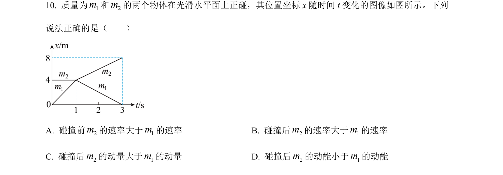
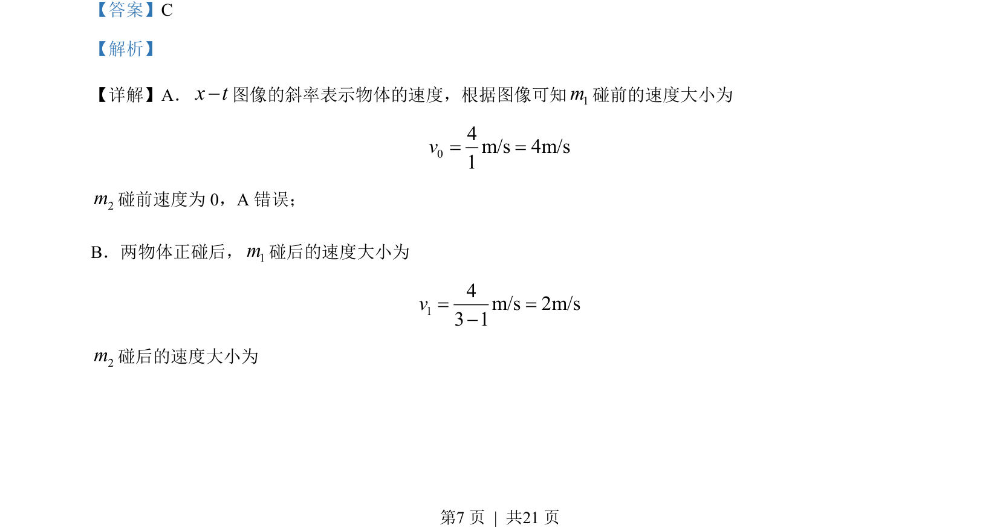
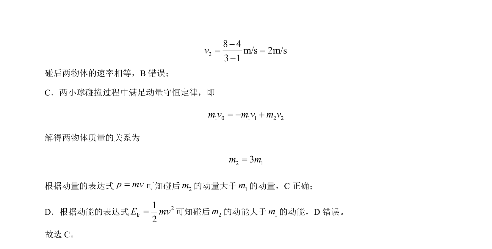

## 题面

## 摘要

一维碰撞问题，结合位移-时间图像分析速度、动量守恒及动能关系。

## 关联考点

- [[位移-时间图像]]
- [[347-动量守恒定律|动量守恒定律]]
- [[346-动量|动量]]
- [[067-动能|动能]]
- [[372-碰撞|碰撞]]

## 答案与解析

> 📄 原 PDF 第 7 页：`素材/真题/北京/2008-2024·（北京）物理高考真题/2022年高考物理试卷（北京）（解析卷）.pdf`

<!-- 题干文本-start -->
## 题干文本
10. 质量为1m和2m的两个物体在光滑水平面上正碰，其位置坐标 x随时间 t变化的图像如图所示。下列
说法正确的是（　　）
A. 碰撞前2m的速率大于1m的速率 B. 碰撞后2m的速率大于1m的速率
C. 碰撞后2m的动量大于1m的动量 D. 碰撞后2m的动能小于1m的动能
<!-- 题干文本-end -->

<!-- 解析文本-start -->
## 解析文本
【答案】C
【解析】
【详解】A．x t-图像的斜率表示物体的速度，根据图像可知1m碰前的速度大小为
04m/s 4m/s1= =v2m碰前速度为 0，A 错误；
B．两物体正碰后，1m碰后的速度大小为
14m/s 2m/s3 1v= =-2m碰后的速度大小为
<!-- 解析文本-end -->
