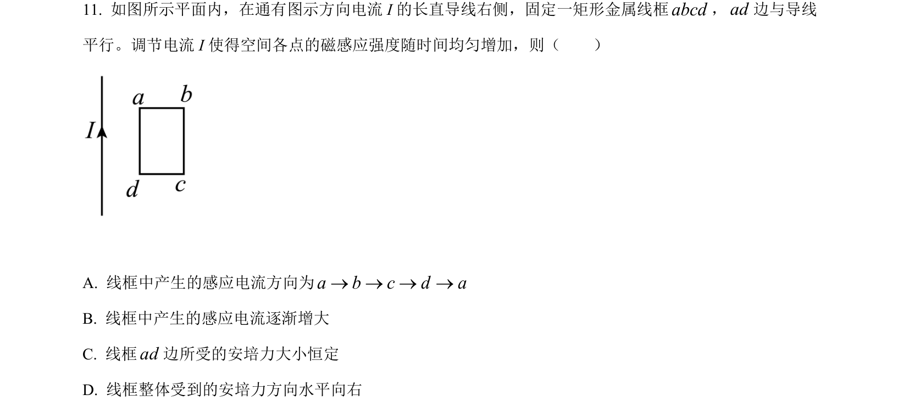
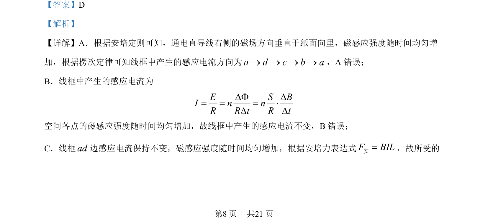
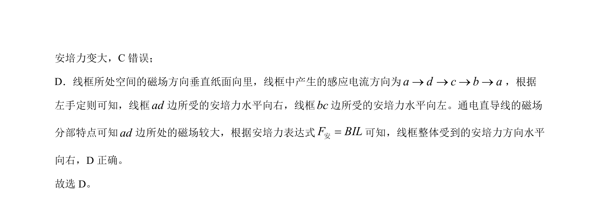

## 题面

## 摘要

通电直导线磁场变化引起线框感应电流方向、大小及安培力分析

## 关联考点

- [[393-楞次定律|楞次定律]]
- [[395-法拉第电磁感应定律|法拉第电磁感应定律]]
- [[188-磁场对通电导体的作用|安培力]]
- [[磁场分布]]

## 答案与解析

> 📄 原 PDF 第 8 页：`素材/真题/北京/2008-2024·（北京）物理高考真题/2022年高考物理试卷（北京）（解析卷）.pdf`

<!-- 题干文本-start -->
## 题干文本
11. 如图所示平面内，在通有图示方向电流 I 的长直导线右侧，固定一矩形金属线框abcd，ad边与导线
平行。调节电流 I 使得空间各点的磁感应强度随时间均匀增加，则（　　）
A. 线框中产生的感应电流方向为a b c d a® ® ® ®
B. 线框中产生的感应电流逐渐增大
C. 线框ad边所受的安培力大小恒定
D. 线框整体受到的安培力方向水平向右
<!-- 题干文本-end -->

<!-- 解析文本-start -->
## 解析文本
【答案】D
【解析】
【详解】A．根据安培定则可知，通电直导线右侧的磁场方向垂直于纸面向里，磁感应强度随时间均匀增
加，根据楞次定律可知线框中产生的感应电流方向为a d c b a® ® ® ®，A 错误；
B．线框中产生的感应电流为
E S BI n nR R t R tF = = = × 
空间各点的磁感应强度随时间均匀增加，故线框中产生的感应电流不变，B错误；
C．线框ad边感应电流保持不变，磁感应强度随时间均匀增加，根据安培力表达式F BIL=安，故所受的
<!-- 解析文本-end -->
