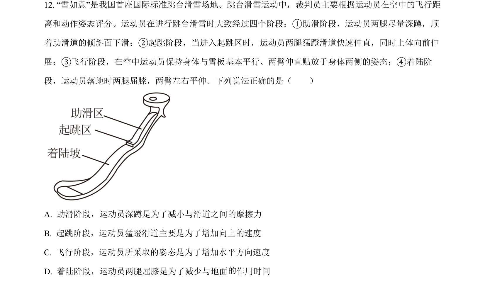
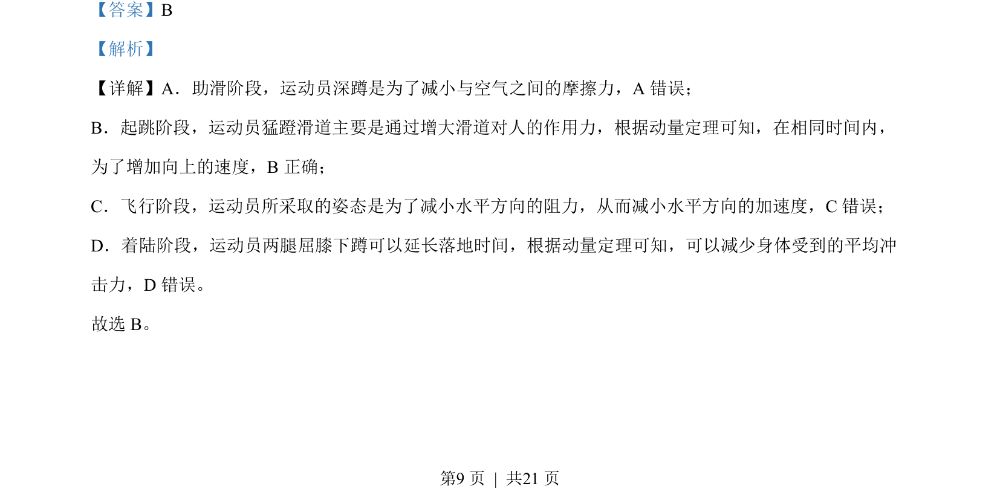

## 题面

## 摘要

考查滑雪运动员各阶段动作原理，涉及摩擦力、动量定理等基本概念应用。

## 关联考点

- [[081-摩擦力|摩擦力]]
- [[349-动量定理|动量定理]]
- [[850-空气阻力|空气阻力]]
- [[345-冲量|冲量]]

## 答案与解析

> 📄 原 PDF 第 9 页：`素材/真题/北京/2008-2024·（北京）物理高考真题/2022年高考物理试卷（北京）（解析卷）.pdf`
