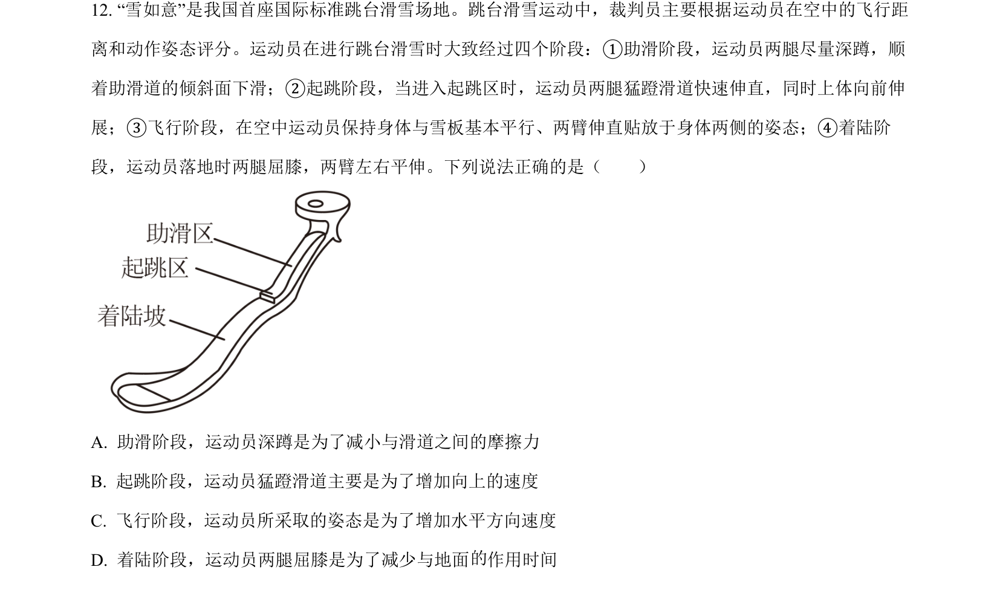
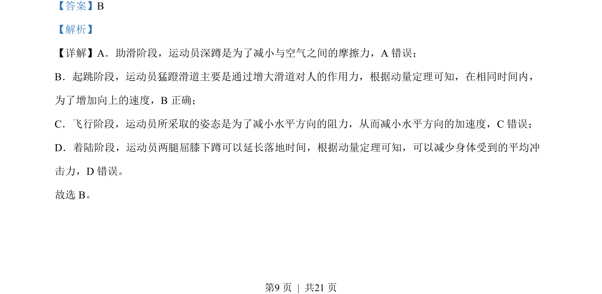

## 题面

## 摘要

考查滑雪运动员各阶段动作原理，涉及摩擦力、动量定理等基本概念应用。

## 关联考点

- [[081-摩擦力|摩擦力]]
- [[349-动量定理|动量定理]]
- [[850-空气阻力|空气阻力]]
- [[345-冲量|冲量]]

## 答案与解析

> 📄 原 PDF 第 9 页：`素材/真题/北京/2008-2024·（北京）物理高考真题/2022年高考物理试卷（北京）（解析卷）.pdf`

<!-- 题干文本-start -->
## 题干文本
12. “雪如意”是我国首座国际标准跳台滑雪场地。跳台滑雪运动中，裁判员主要根据运动员在空中的飞行距
离和动作姿态评分。运动员在进行跳台滑雪时大致经过四个阶段：①助滑阶段，运动员两腿尽量深蹲，顺
着助滑道的倾斜面下滑；②起跳阶段，当进入起跳区时，运动员两腿猛蹬滑道快速伸直，同时上体向前伸
展；③飞行阶段，在空中运动员保持身体与雪板基本平行、两臂伸直贴放于身体两侧的姿态；④着陆阶
段，运动员落地时两腿屈膝，两臂左右平伸。下列说法正确的是（　　）
A. 助滑阶段，运动员深蹲是为了减小与滑道之间的摩擦力
B. 起跳阶段，运动员猛蹬滑道主要是为了增加向上的速度
C. 飞行阶段，运动员所采取的姿态是为了增加水平方向速度
D. 着陆阶段，运动员两腿屈膝是为了减少与地面 作用时间
<!-- 题干文本-end -->

<!-- 解析文本-start -->
## 解析文本
【答案】B
【解析】
【详解】A．助滑阶段，运动员深蹲是为了减小与空气之间的摩擦力，A 错误；
B．起跳阶段，运动员猛蹬滑道主要是通过增大滑道对人的作用力，根据动量定理可知，在相同时间内，
为了增加向上的速度，B正确；
C．飞行阶段，运动员所采取的姿态是为了减小水平方向的阻力，从而减小水平方向的加速度，C错误；
D．着陆阶段，运动员两腿屈膝下蹲可以延长落地时间，根据动量定理可知，可以减少身体受到的平均冲
击力，D 错误。
故选 B。
的
<!-- 解析文本-end -->
