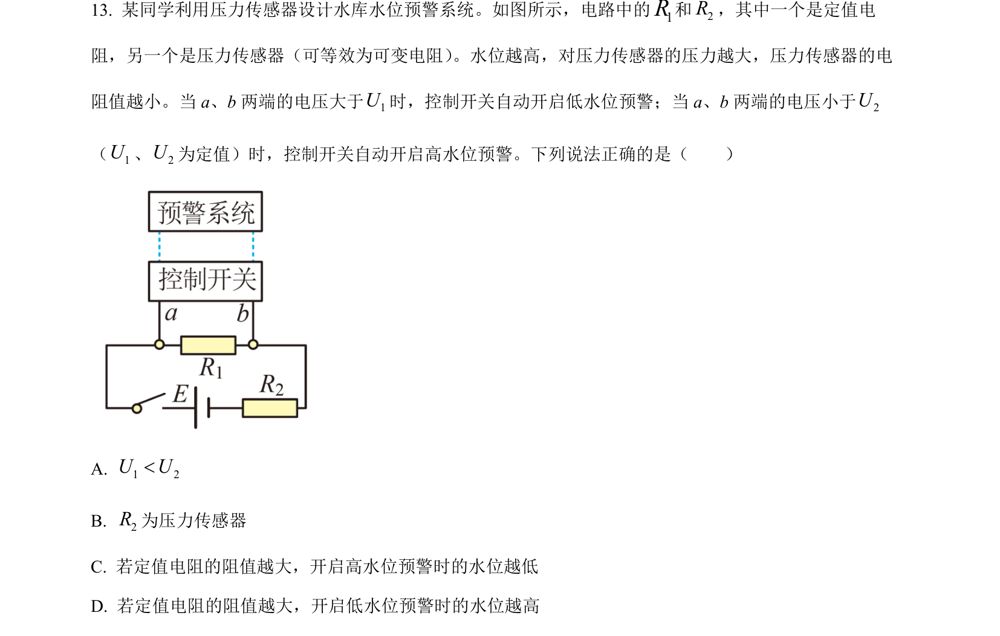
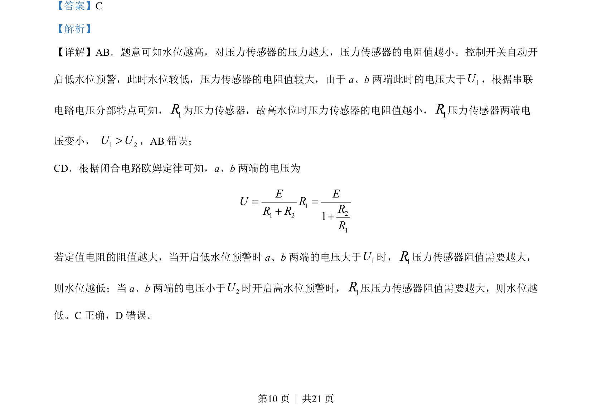

## 题面

## 摘要

电路分析水位预警控制，利用传感器电阻变化与串联分压关系实现高低水位判断。

## 关联考点

- [[传感器电阻特性]]
- [[串联电路分压]]
- [[332-闭合电路欧姆定律|闭合电路欧姆定律]]

## 答案与解析

> 📄 原 PDF 第 10 页：`素材/真题/北京/2008-2024·（北京）物理高考真题/2022年高考物理试卷（北京）（解析卷）.pdf`
