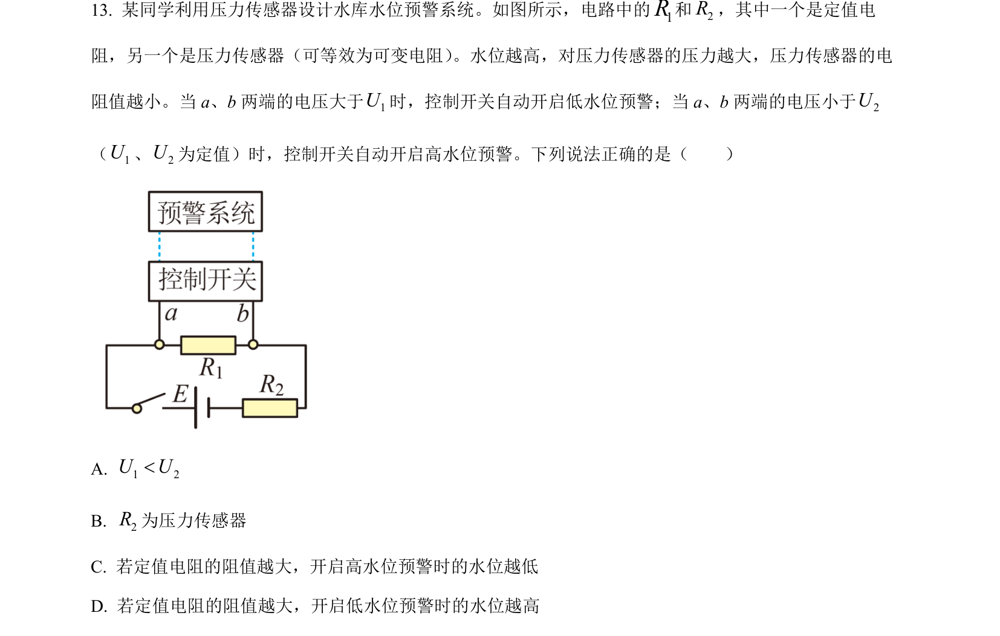
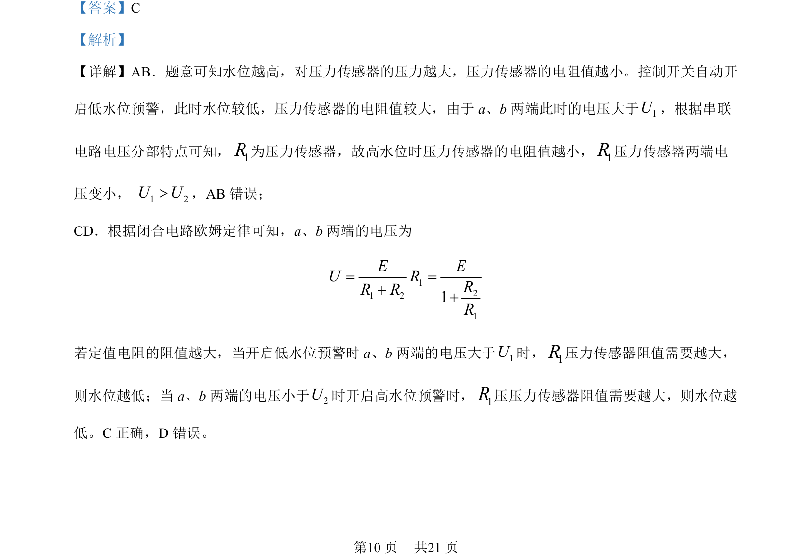

## 题面

## 摘要

电路分析水位预警控制，利用传感器电阻变化与串联分压关系实现高低水位判断。

## 关联考点

- [[传感器电阻特性]]
- [[串联电路分压]]
- [[332-闭合电路欧姆定律|闭合电路欧姆定律]]

## 答案与解析

> 📄 原 PDF 第 10 页：`素材/真题/北京/2008-2024·（北京）物理高考真题/2022年高考物理试卷（北京）（解析卷）.pdf`

<!-- 题干文本-start -->
## 题干文本
13. 某同学利用压力传感器设计水库水位预警系统。如图所示，电路中的1R和2R，其中一个是定值电
阻，另一个是压力传感器（可等效为可变电阻） 。水位越高，对压力传感器的压力越大，压力传感器的电
阻值越小。当 a、b 两端的电压大于1U时，控制开关自动开启低水位预警；当 a、b 两端的电压小于2U
（1U、2U为定值）时，控制开关自动开启高水位预警。下列说法正确的是（　　）
A. 1 2U U<
B. 2R为压力传感器
C. 若定值电阻的阻值越大，开启高水位预警时的水位越低
D. 若定值电阻的阻值越大，开启低水位预警时的水位越高
<!-- 题干文本-end -->

<!-- 解析文本-start -->
## 解析文本
【答案】C
【解析】
【详解】AB．题意可知水位越高，对压力传感器的压力越大，压力传感器的电阻值越小。控制开关自动开
启低水位预警，此时水位较低，压力传感器的电阻值较大，由于 a、b 两端此时的电压大于1U，根据串联
电路电压分部特点可知，1R为压力传感器，故高水位时压力传感器的电阻值越小，1R压力传感器两端电
压变小， 1 2U U>，AB 错误；
CD．根据闭合电路欧姆定律可知，a、b 两端的电压为
121 211E EU RRR RR= =++
若定值电阻的阻值越大，当开启低水位预警时 a、b 两端的电压大于1U时，1R压力传感器阻值需要越大，
则水位越低；当 a、b 两端的电压小于2U时开启高水位预警时，1R压压力传感器阻值需要越大，则水位越
低。C正确，D 错误。
<!-- 解析文本-end -->
