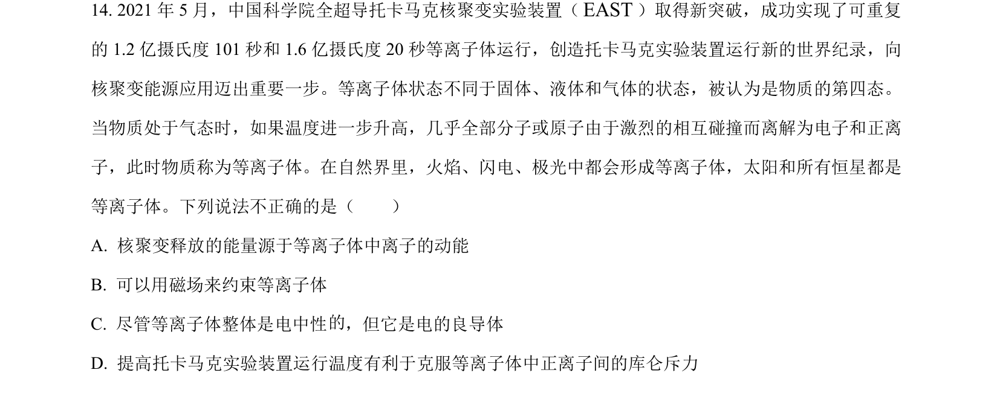
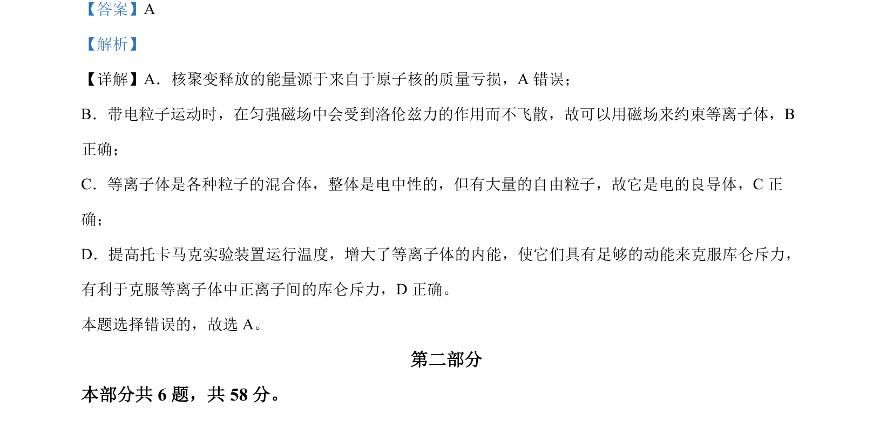

## 题面

## 摘要

该题考查核聚变能量来源、磁场约束等离子体原理、等离子体导电性及温度对聚变的影响。

## 关联考点

- [[140-核能|核聚变]]
- [[449-质能方程|质量亏损]]
- [[304-洛伦兹力|洛伦兹力]]
- [[等离子体]]

## 答案与解析

> 📄 原 PDF 第 11 页：`素材/真题/北京/2008-2024·（北京）物理高考真题/2022年高考物理试卷（北京）（解析卷）.pdf`
