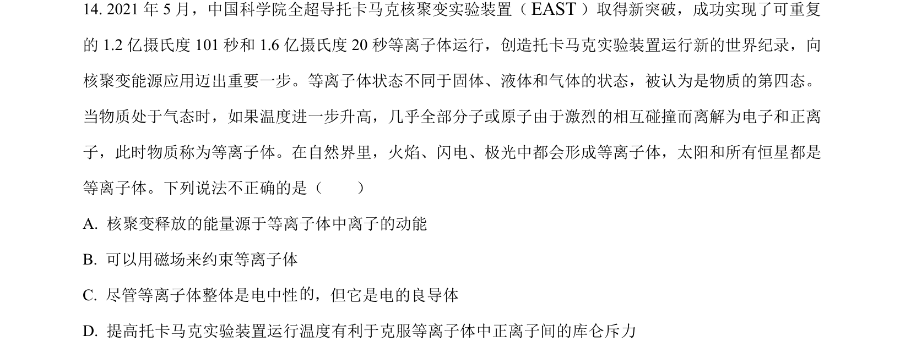
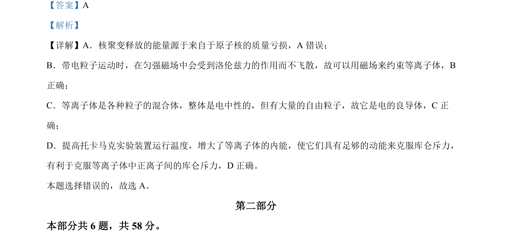

## 题面

## 摘要

该题考查核聚变能量来源、磁场约束等离子体原理、等离子体导电性及温度对聚变的影响。

## 关联考点

- [[140-核能|核聚变]]
- [[449-质能方程|质量亏损]]
- [[304-洛伦兹力|洛伦兹力]]
- [[等离子体]]

## 答案与解析

> 📄 原 PDF 第 11 页：`素材/真题/北京/2008-2024·（北京）物理高考真题/2022年高考物理试卷（北京）（解析卷）.pdf`

<!-- 题干文本-start -->
## 题干文本
14. 2021 年 5 月，中国科学院全超导托卡马克核聚变实验装置（EAST）取得新突破，成功实现了可重复
的 1.2 亿摄氏度 101 秒和 1.6 亿摄氏度 20 秒等离子体运行，创造托卡马克实验装置运行新的世界纪录，向
核聚变能源应用迈出重要一步。等离子体状态不同于固体、液体和气体的状态，被认为是物质的第四态。
当物质处于气态时，如果温度进一步升高，几乎全部分子或原子由于激烈的相互碰撞而离解为电子和正离
子，此时物质称为等离子体。在自然界里，火焰、闪电、极光中都会形成等离子体，太阳和所有恒星都是
等离子体。下列说法不正确的是（　　）
A. 核聚变释放的能量源于等离子体中离子的动能
B. 可以用磁场来约束等离子体
C. 尽管等离子体整体是电中性 ，但它是电的良导体
D. 提高托卡马克实验装置运行温度有利于克服等离子体中正离子间的库仑斥力
<!-- 题干文本-end -->

<!-- 解析文本-start -->
## 解析文本
【答案】A
【解析】
【详解】A．核聚变释放的能量源于来自于原子核的质量亏损，A 错误；
B．带电粒子运动时，在匀强磁场中会受到洛伦兹力的作用而不飞散，故可以用磁场来约束等离子体，B
正确；
C．等离子体是各种粒子的混合体，整体是电中性的，但有大量的自由粒子，故它是电的良导体，C正
确；
D．提高托卡马克实验装置运行温度，增大了等离子体的内能，使它们具有足够的动能来克服库仑斥力，
有利于克服等离子体中正离子间的库仑斥力，D 正确。
本题选择错误的，故选 A。
第二部分
本部分共 6 题，共 58 分。
<!-- 解析文本-end -->
