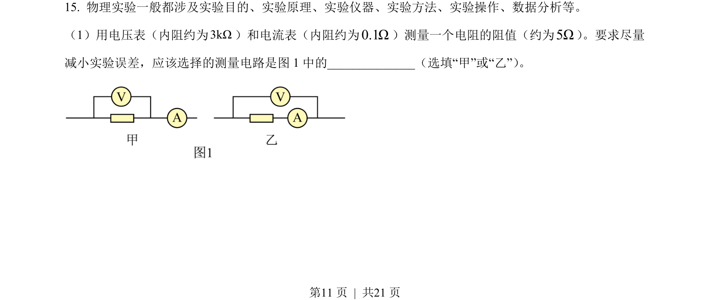
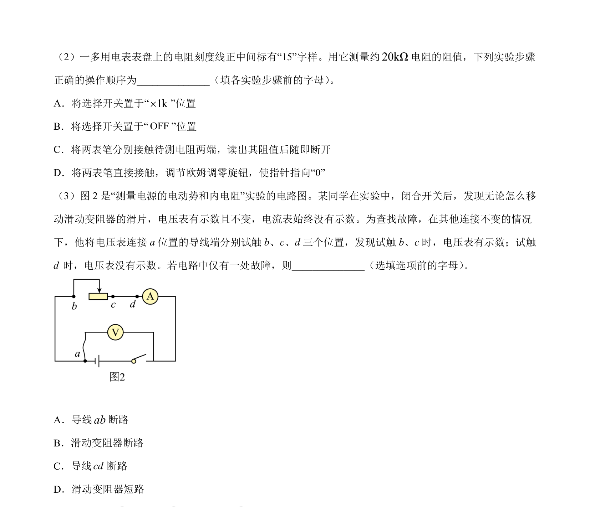
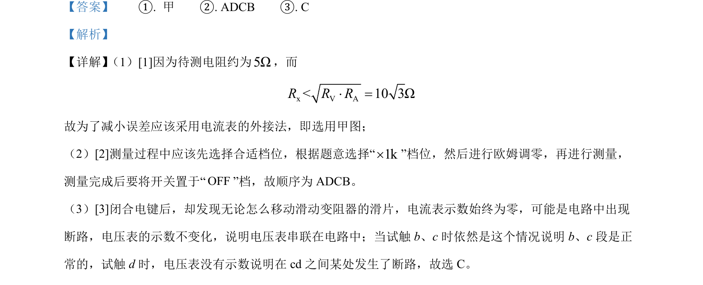

## 题面

## 摘要

考查伏安法测电阻中电流表接法选择、多用电表欧姆档操作及电路故障分析。

## 关联考点

- [[511-伏安法测电阻|伏安法测电阻]]
- [[833-电流表内外接|电流表内外接]]
- [[576-多用电表使用|多用电表使用]]
- [[183-电路故障分析|电路故障分析]]

## 答案与解析

> 📄 原 PDF 第 11 页：`素材/真题/北京/2008-2024·（北京）物理高考真题/2022年高考物理试卷（北京）（解析卷）.pdf`
