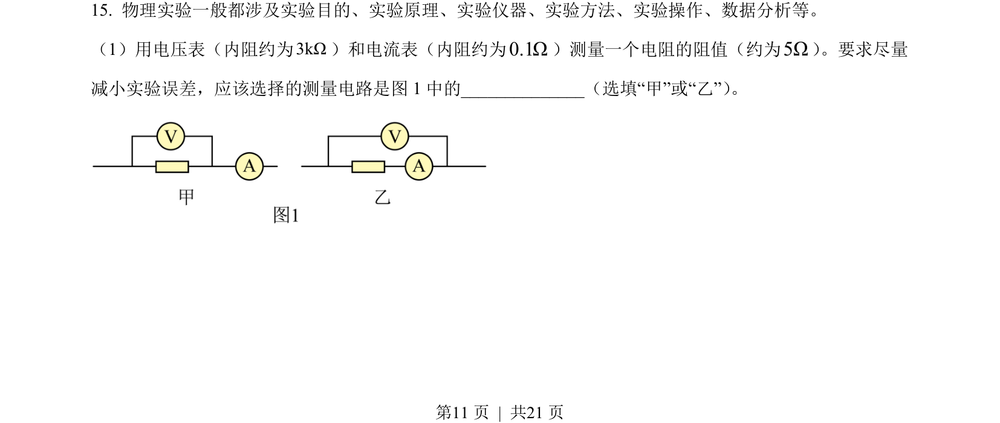
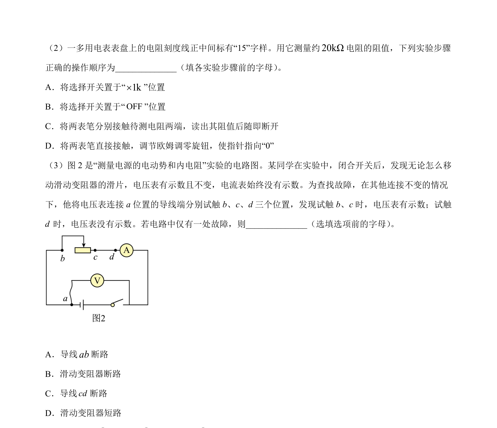
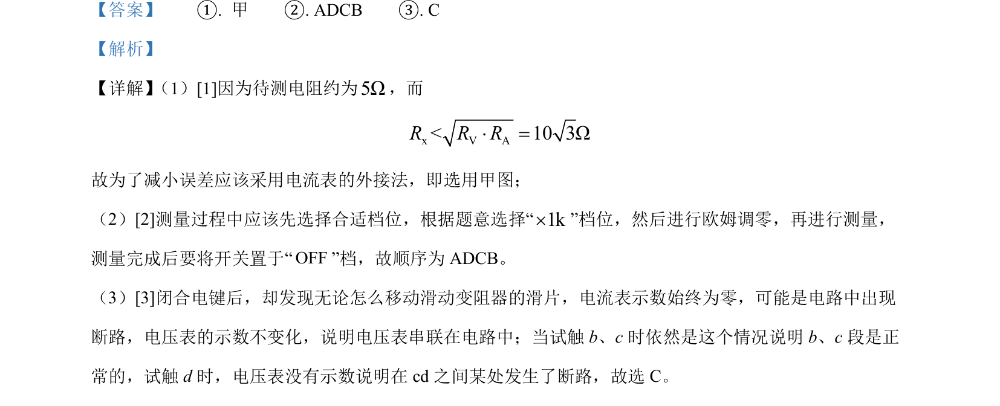

## 题面

## 摘要

考查伏安法测电阻中电流表接法选择、多用电表欧姆档操作及电路故障分析。

## 关联考点

- [[511-伏安法测电阻|伏安法测电阻]]
- [[833-电流表内外接|电流表内外接]]
- [[784-多用电表的使用|多用电表使用]]
- [[183-电路故障分析|电路故障分析]]

## 答案与解析

> 📄 原 PDF 第 11 页：`素材/真题/北京/2008-2024·（北京）物理高考真题/2022年高考物理试卷（北京）（解析卷）.pdf`

<!-- 题干文本-start -->
## 题干文本
15. 物理实验一般都涉及实验目的、实验原理、实验仪器、实验方法、实验操作、数据分析等。
（1）用电压表（内阻约为3kΩ）和电流表（内阻约为0.1Ω）测量一个电阻的阻值（约为5Ω） 。要求尽量
减小实验误差，应该选择的测量电路是图 1 中的______________（选填“甲”或“乙”） 。
的
<!-- 题干文本-end -->

<!-- 解析文本-start -->
## 解析文本

<!-- 解析文本-end -->
