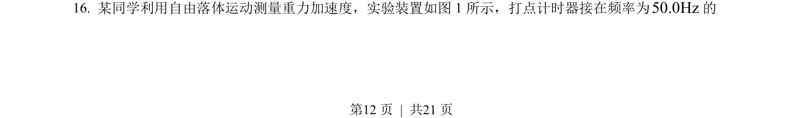
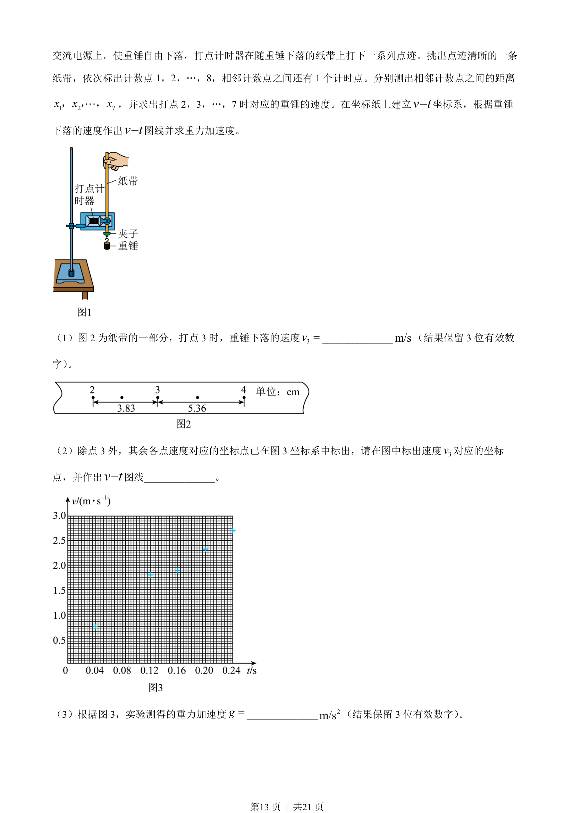
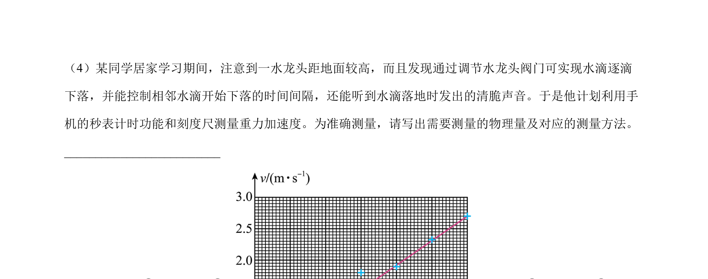
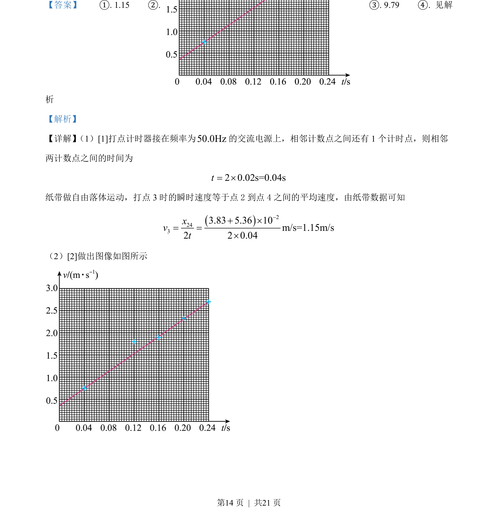
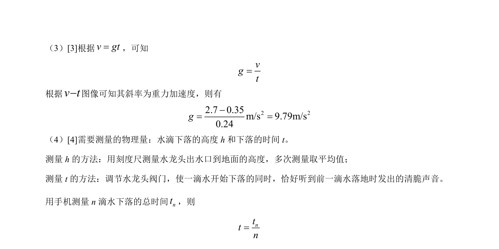

## 题面

## 摘要

利用打点计时器和纸带研究自由落体运动，通过计算瞬时速度并作v-t图像求重力加速度，并讨论水滴法测重力加速度的方案

## 关联考点

- [[756-打点计时器|打点计时器]]
- [[463-瞬时变化率|瞬时速度]]
- [[115-重力加速度-初中|重力加速度]]
- [[v-t图像斜率]]

## 答案与解析

> 📄 原 PDF 第 12 页：`素材/真题/北京/2008-2024·（北京）物理高考真题/2022年高考物理试卷（北京）（解析卷）.pdf`
