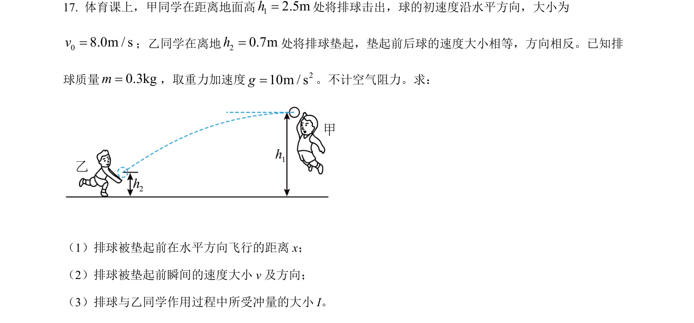
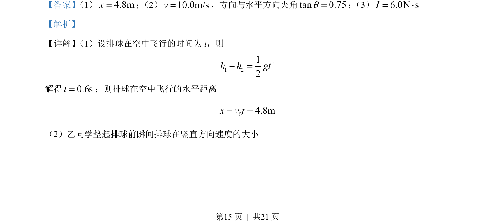
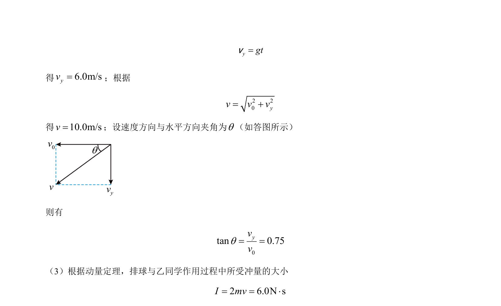

## 题面

## 摘要

本题研究排球的平抛运动及碰撞过程，计算飞行时间、水平位移、落地速度及冲量。

## 关联考点

- [[261-平抛运动|平抛运动]]
- [[288-运动的合成与分解|运动的合成与分解]]
- [[349-动量定理|动量定理]]
- [[215-匀变速直线运动|匀变速直线运动]]

## 答案与解析

> 📄 原 PDF 第 15 页：`素材/真题/北京/2008-2024·（北京）物理高考真题/2022年高考物理试卷（北京）（解析卷）.pdf`
