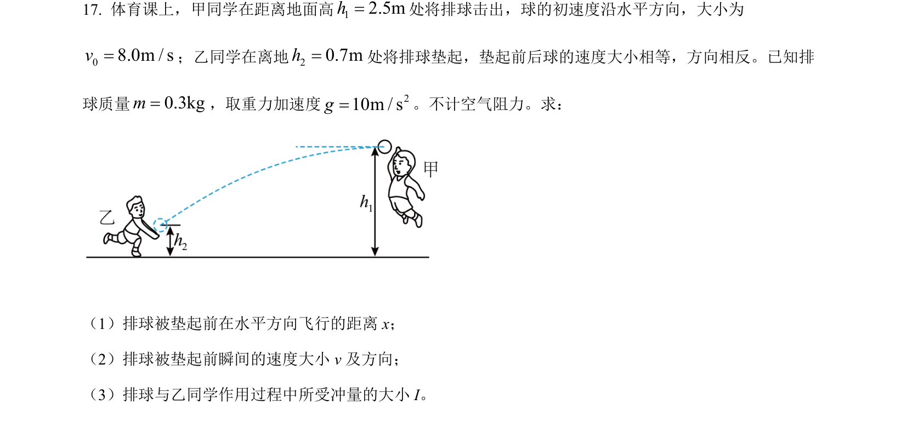
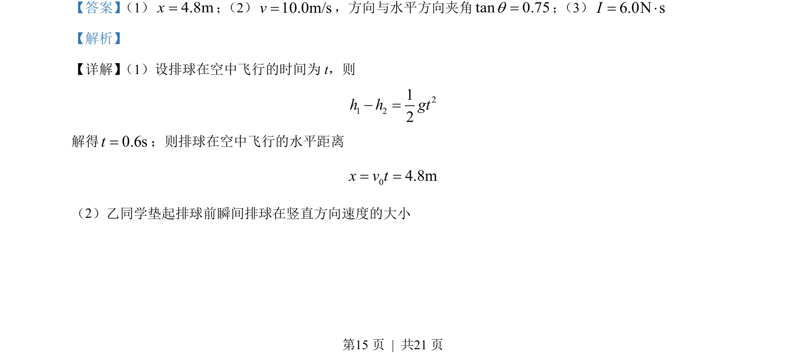
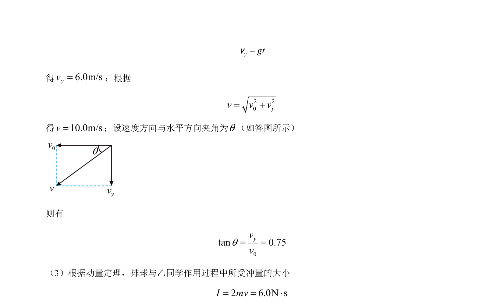

## 题面

## 摘要

本题研究排球的平抛运动及碰撞过程，计算飞行时间、水平位移、落地速度及冲量。

## 关联考点

- [[261-平抛运动|平抛运动]]
- [[288-运动的合成与分解|运动的合成与分解]]
- [[349-动量定理|动量定理]]
- [[215-匀变速直线运动|匀变速直线运动]]

## 答案与解析

> 📄 原 PDF 第 15 页：`素材/真题/北京/2008-2024·（北京）物理高考真题/2022年高考物理试卷（北京）（解析卷）.pdf`

<!-- 题干文本-start -->
## 题干文本
17. 体育课上，甲同学在距离地面高12.5mh=处将排球击出，球的初速度沿水平方向，大小为
08.0m / sv=；乙同学在离地20.7mh=处将排球垫起，垫起前后球的速度大小相等，方向相反。已知排
球质量0.3kgm=，取重力加速度 210m / sg=。不计空气阻力。求：
（1）排球被垫起前在水平方向飞行的距离 x；
（2）排球被垫起前瞬间的速度大小 v及方向；
（3）排球与乙同学作用过程中所受冲量的大小 I。
<!-- 题干文本-end -->

<!-- 解析文本-start -->
## 解析文本
【答案】 （1）4.8mx=； （2）10.0m/sv=，方向与水平方向夹角tan 0.75q=； （3）6.0N sI= ×
【解析】
【详解】 （1）设排球在空中飞行的时间为 t，则
21 212h hgt- =
解得0.6st=；则排球在空中飞行的水平距离
04.8mx v t= =
（2）乙同学垫起排球前瞬间排球在竖直方向速度的大小
<!-- 解析文本-end -->
