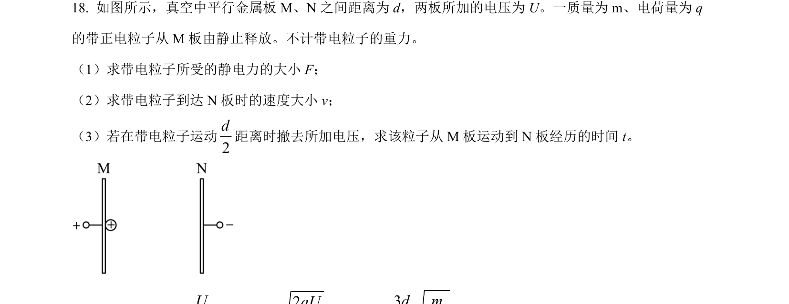
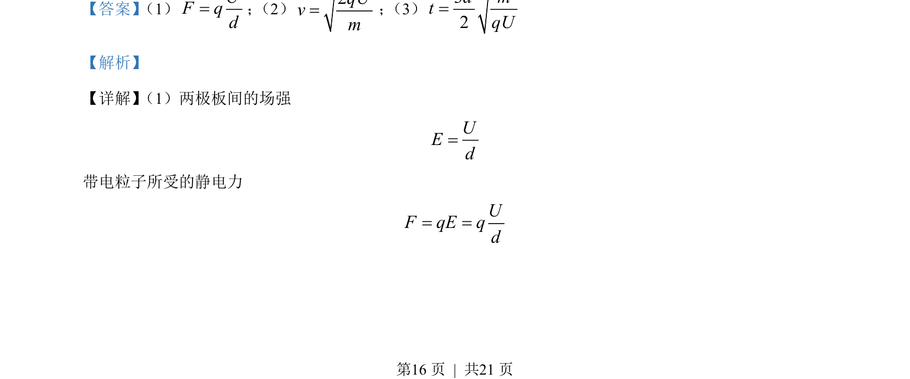
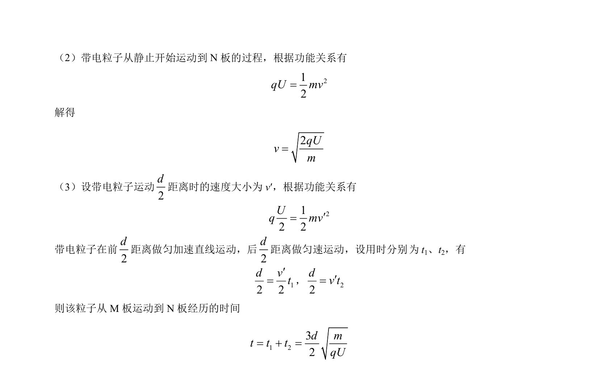

## 题面

## 摘要

带电粒子在平行板电容器中由静止加速，并分段计算运动时间。

## 关联考点

- [[277-电场强度|电场强度]]
- [[672-电场力|静电力]]
- [[249-功能关系|功能关系]]
- [[215-匀变速直线运动|匀变速直线运动]]

## 答案与解析

> 📄 原 PDF 第 16 页：`素材/真题/北京/2008-2024·（北京）物理高考真题/2022年高考物理试卷（北京）（解析卷）.pdf`
