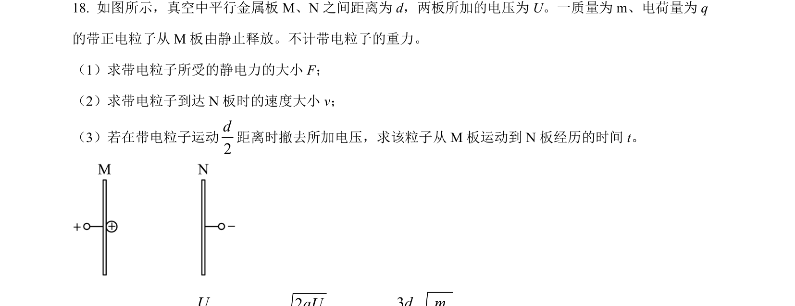
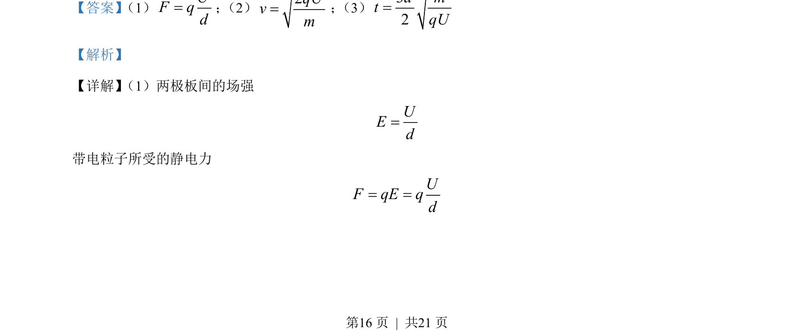
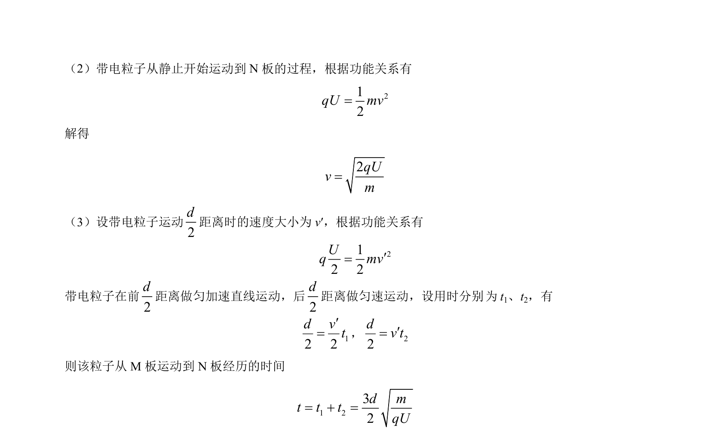

## 题面

## 摘要

带电粒子在平行板电容器中由静止加速，并分段计算运动时间。

## 关联考点

- [[277-电场强度|电场强度]]
- [[672-电场力|静电力]]
- [[249-功能关系|功能关系]]
- [[215-匀变速直线运动|匀变速直线运动]]

## 答案与解析

> 📄 原 PDF 第 16 页：`素材/真题/北京/2008-2024·（北京）物理高考真题/2022年高考物理试卷（北京）（解析卷）.pdf`

<!-- 题干文本-start -->
## 题干文本
18. 如图所示，真空中平行金属板 M、N 之间距离为 d，两板所加的电压为 U。一质量为 m、电荷量为 q
的带正电粒子从 M 板由静止释放。不计带电粒子的重力。
（1）求带电粒子所受的静电力的大小 F；
（2）求带电粒子到达 N 板时的速度大小 v；
（3）若在带电粒子运动
2d距离时撤去所加电压，求该粒子从 M 板运动到 N 板经历的时间 t。
<!-- 题干文本-end -->

<!-- 解析文本-start -->
## 解析文本
【答案】 （1）UF qd=； （2）2qUvm=； （3）32d mtqU=
【解析】
【详解】 （1）两极板间的场强
UEd=
带电粒子所受的静电力
UF qE qd= =
<!-- 解析文本-end -->
