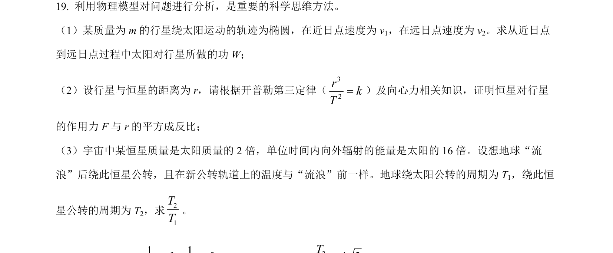
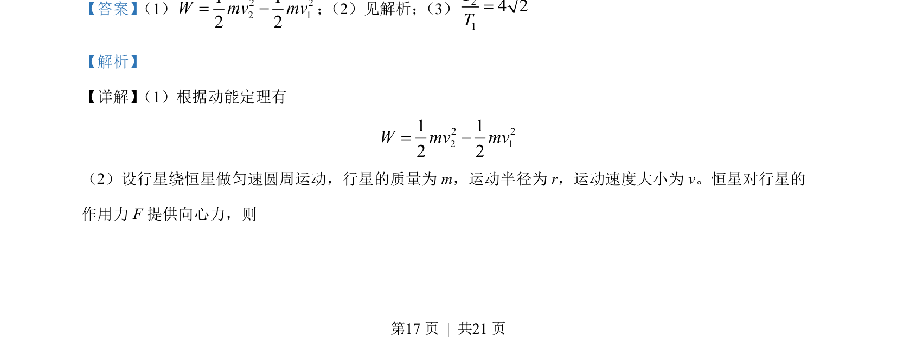
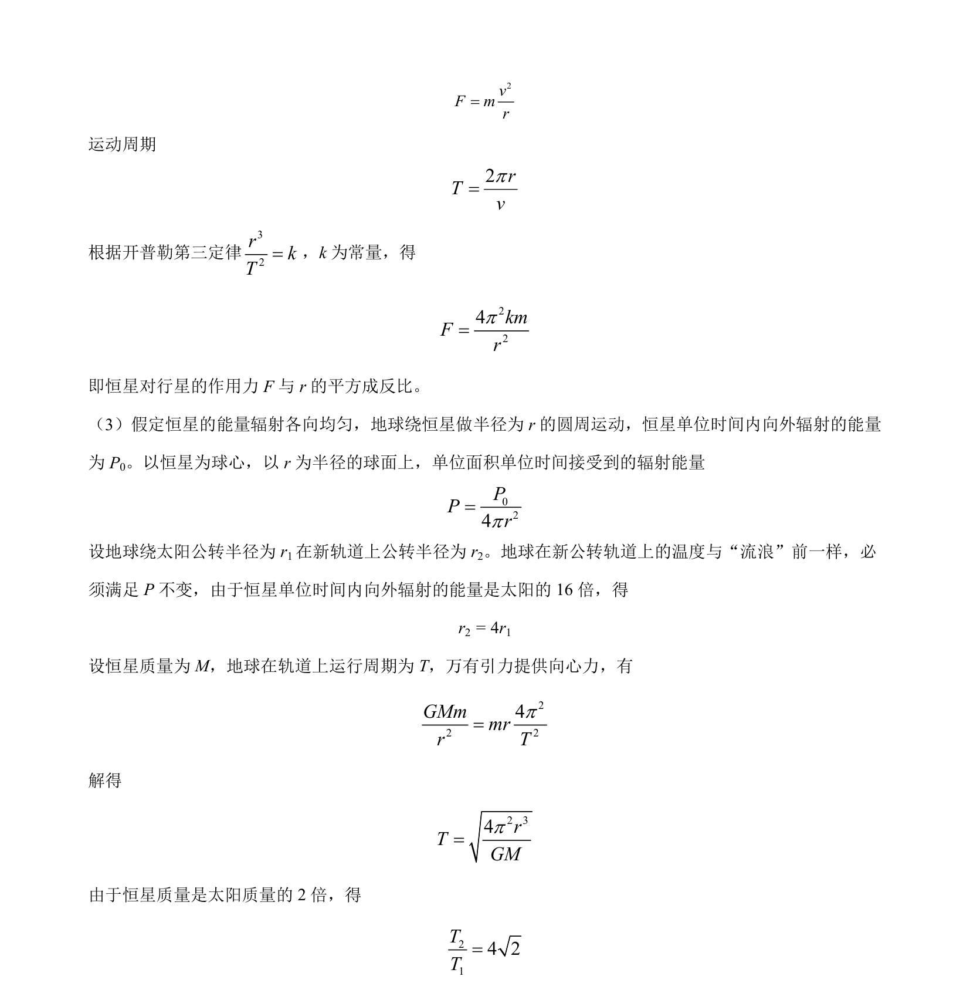

## 题面

## 摘要

考查动能定理、万有引力定律、开普勒第三定律及辐射能量平衡的综合计算。

## 关联考点

- [[251-动能定理|动能定理]]
- [[246-万有引力定律|万有引力定律]]
- [[266-开普勒第三定律|开普勒第三定律]]
- [[258-圆周运动|圆周运动]]

## 答案与解析

> 📄 原 PDF 第 17 页：`素材/真题/北京/2008-2024·（北京）物理高考真题/2022年高考物理试卷（北京）（解析卷）.pdf`
