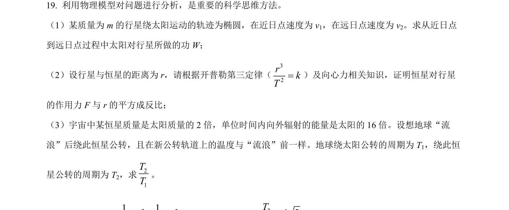
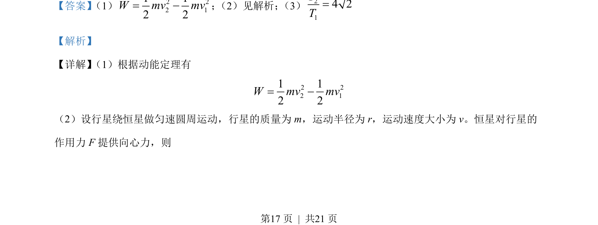
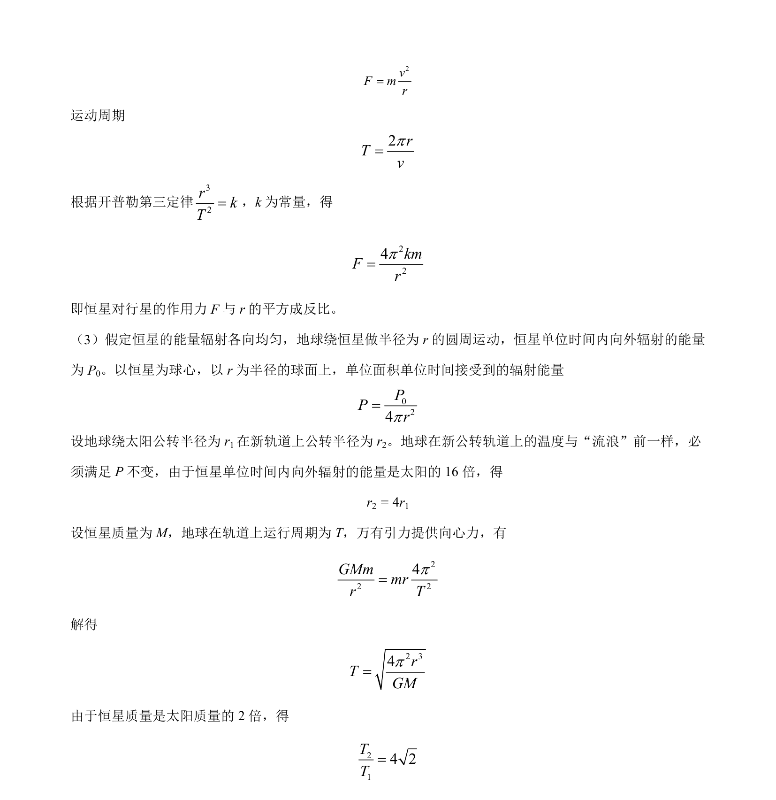

## 题面

## 摘要

考查动能定理、万有引力定律、开普勒第三定律及辐射能量平衡的综合计算。

## 关联考点

- [[251-动能定理|动能定理]]
- [[246-万有引力定律|万有引力定律]]
- [[266-开普勒第三定律|开普勒第三定律]]
- [[258-圆周运动|圆周运动]]

## 答案与解析

> 📄 原 PDF 第 17 页：`素材/真题/北京/2008-2024·（北京）物理高考真题/2022年高考物理试卷（北京）（解析卷）.pdf`

<!-- 题干文本-start -->
## 题干文本
19. 利用物理模型对问题进行分析，是重要的科学思维方法。
（1）某质量为 m 的行星绕太阳运动的轨迹为椭圆，在近日点速度为 v1，在远日点速度为 v2。求从近日点
到远日点过程中太阳对行星所做的功 W；
（2）设行星与恒星的距离为 r，请根据开普勒第三定律（
32rkT=）及向心力相关知识，证明恒星对行星
的作用力 F与 r 的平方成反比；
（3）宇宙中某恒星质量是太阳质量的 2 倍，单位时间内向外辐射的能量是太阳的 16 倍。设想地球“流
浪”后绕此恒星公转，且在新公转轨道上的温度与“流浪”前一样。地球绕太阳公转的周期为 T1，绕此恒
星公转的周期为 T2，求21TT。
<!-- 题干文本-end -->

<!-- 解析文本-start -->
## 解析文本
【答案】 （1） 2 22 11 12 2W mv mv= -； （2）见解析； （3）214 2TT=
【解析】
【详解】 （1）根据动能定理有
2 22 11 12 2W mv mv= -
（2）设行星绕恒星做匀速圆周运动，行星的质量为 m，运动半径为 r，运动速度大小为 v。恒星对行星的
作用力 F提供向心力，则
为
<!-- 解析文本-end -->
