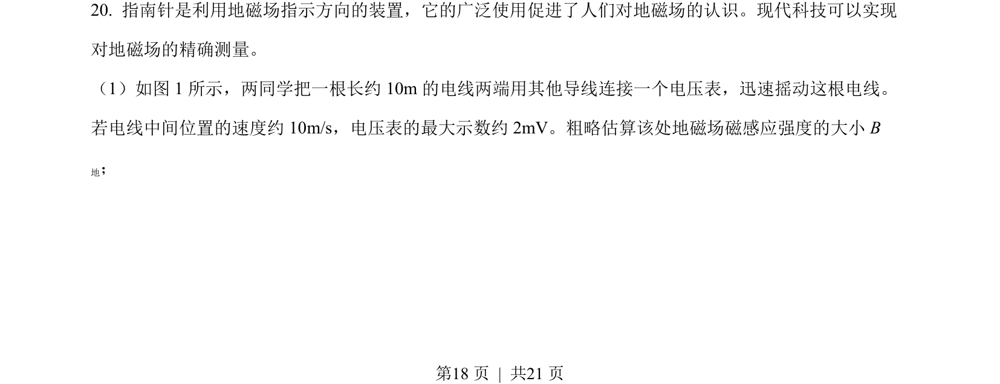
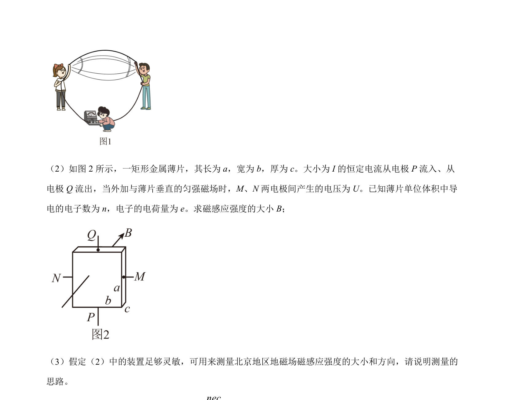
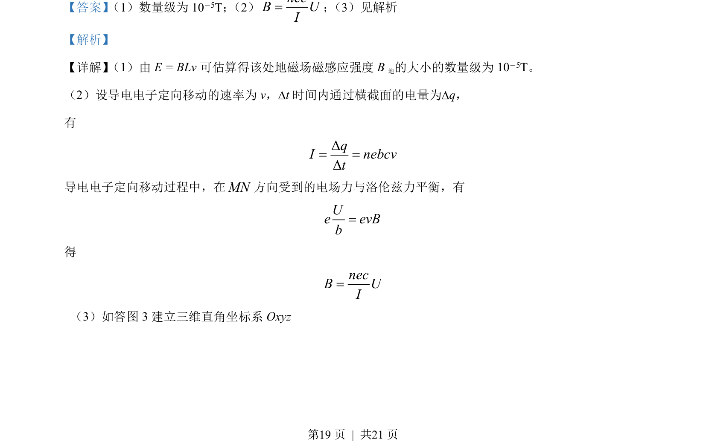
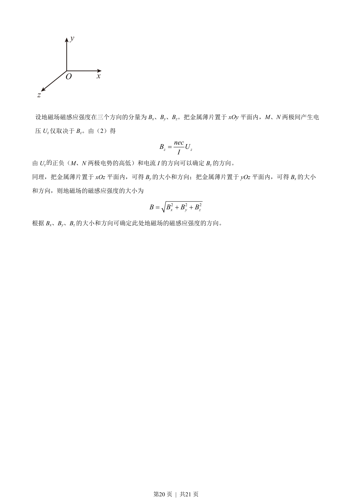

## 题面

## 摘要

该题考查基于霍尔效应原理测量地磁场磁感应强度的大小和方向。

## 关联考点

- [[333-霍尔效应|霍尔效应]]
- [[132-地磁场|地磁场]]
- [[304-洛伦兹力|洛伦兹力]]
- [[701-矢量合成|矢量合成]]

## 答案与解析

> 📄 原 PDF 第 18 页：`素材/真题/北京/2008-2024·（北京）物理高考真题/2022年高考物理试卷（北京）（解析卷）.pdf`
