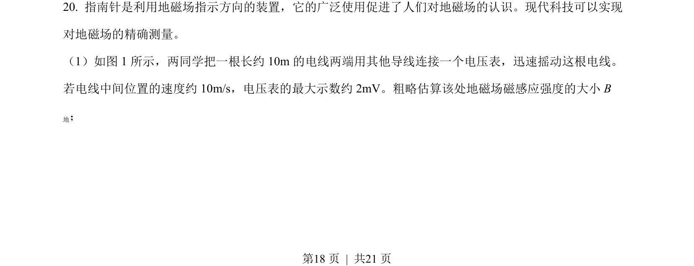
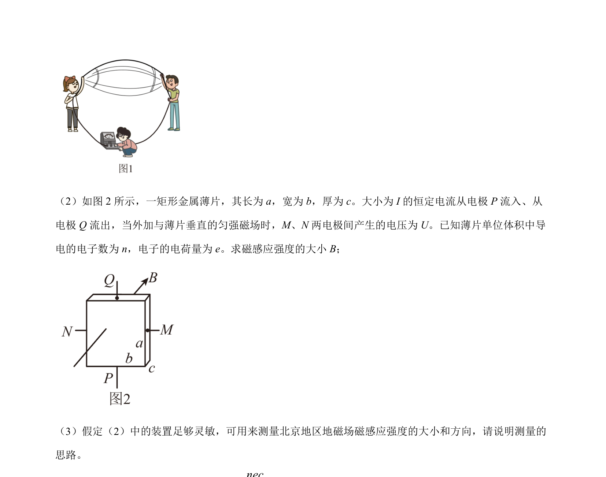
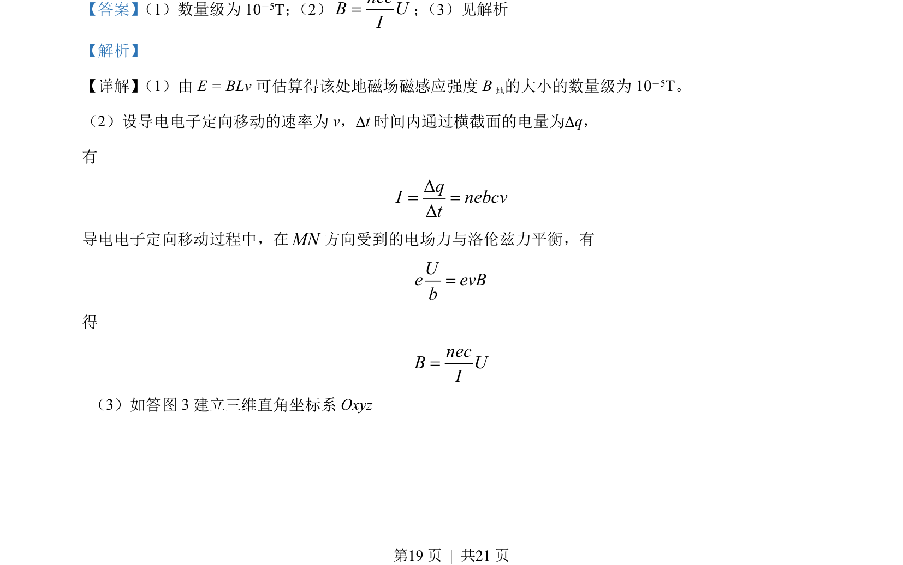
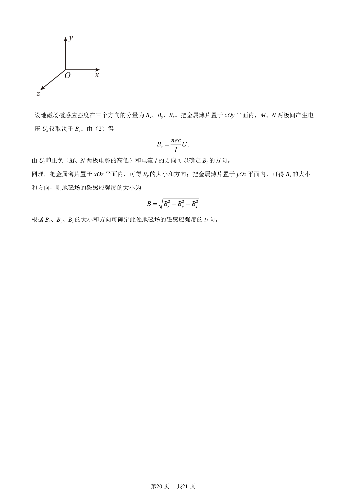

## 题面

## 摘要

该题考查基于霍尔效应原理测量地磁场磁感应强度的大小和方向。

## 关联考点

- [[333-霍尔效应|霍尔效应]]
- [[132-地磁场|地磁场]]
- [[304-洛伦兹力|洛伦兹力]]
- [[701-矢量合成|矢量合成]]

## 答案与解析

> 📄 原 PDF 第 18 页：`素材/真题/北京/2008-2024·（北京）物理高考真题/2022年高考物理试卷（北京）（解析卷）.pdf`

<!-- 题干文本-start -->
## 题干文本
20. 指南针是利用地磁场指示方向的装置，它的广泛使用促进了人们对地磁场的认识。现代科技可以实现
对地磁场的精确测量。
（1）如图 1 所示，两同学把一根长约 10m的电线两端用其他导线连接一个电压表，迅速摇动这根电线。
若电线中间位置的速度约 10m/s，电压表的最大示数约 2mV。粗略估算该处地磁场磁感应强度的大小 B
地；
<!-- 题干文本-end -->

<!-- 解析文本-start -->
## 解析文本

<!-- 解析文本-end -->
