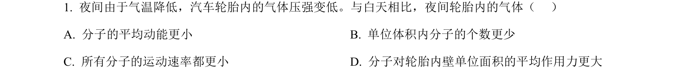
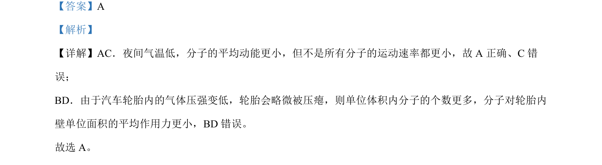

## 题面

## 摘要

夜间气温低时，汽车轮胎内气体分子平均动能与压强变化及微观解释。

## 关联考点

- [[分子平均动能]]
- [[432-气体压强微观解释|气体压强微观解释]]
- [[130-分子热运动|分子热运动]]

## 答案与解析

> 📄 原 PDF 第 1 页：`素材/真题/北京/2008-2024·（北京）物理高考真题/2023年高考物理试卷（北京）（解析卷）.pdf`
