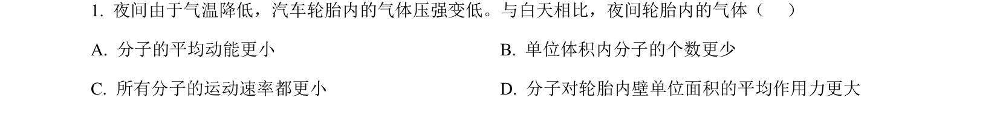
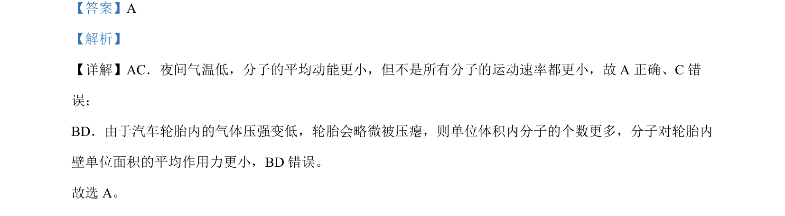

## 题面

## 摘要

夜间气温低时，汽车轮胎内气体分子平均动能与压强变化及微观解释。

## 关联考点

- [[839-分子平均动能|分子平均动能]]
- [[432-气体压强微观解释|气体压强微观解释]]
- [[130-分子热运动|分子热运动]]

## 答案与解析

> 📄 原 PDF 第 1 页：`素材/真题/北京/2008-2024·（北京）物理高考真题/2023年高考物理试卷（北京）（解析卷）.pdf`

<!-- 题干文本-start -->
## 题干文本
1. 夜间由于气温降低，汽车轮胎内的气体压强变低。与白天相比，夜间轮胎内的气体（   ）
A. 分子的平均动能更小 B. 单位体积内分子的个数更少
C. 所有分子的运动速率都更小 D. 分子对轮胎内壁单位面积的平均作用力更大
<!-- 题干文本-end -->

<!-- 解析文本-start -->
## 解析文本
【答案】A
【解析】
【详解】AC．夜间气温低，分子的平均动能更小，但不是所有分子的运动速率都更小，故 A 正确、C错
误；
BD．由于汽车轮胎内的气体压强变低，轮胎会略微被压瘪，则单位体积内分子的个数更多，分子对轮胎内
壁单位面积的平均作用力更小，BD 错误。
故选 A。
<!-- 解析文本-end -->
