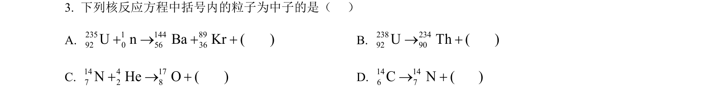
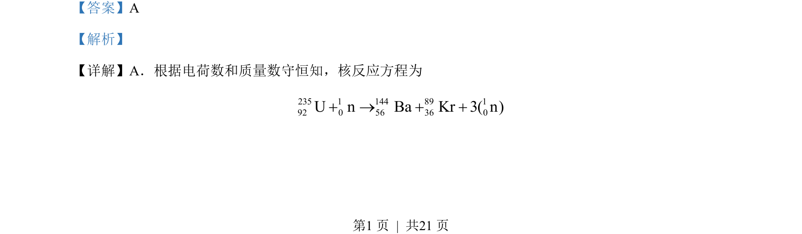
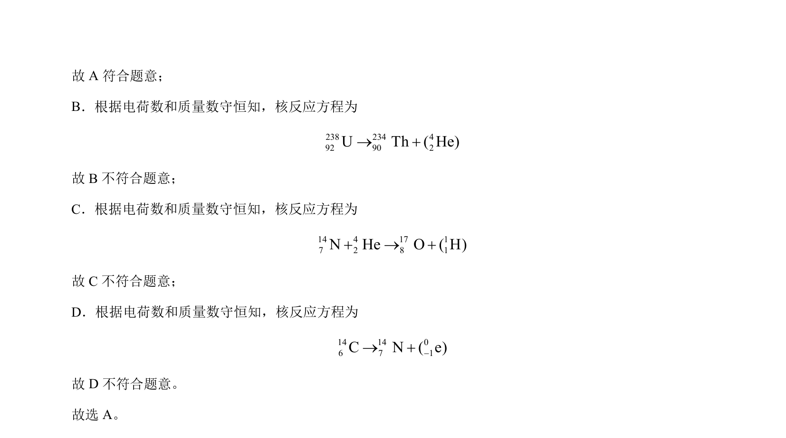

## 题面

## 摘要

本题根据电荷数和质量数守恒判断核反应方程的正误。

## 关联考点

- [[629-核反应方程|核反应方程]]
- [[689-电荷数守恒|电荷数守恒]]
- [[728-质量数守恒|质量数守恒]]

## 答案与解析

> 📄 原 PDF 第 1 页：`素材/真题/北京/2008-2024·（北京）物理高考真题/2023年高考物理试卷（北京）（解析卷）.pdf`

<!-- 题干文本-start -->
## 题干文本
3. 下列核反应方程中括号内的粒子为中子的是（   ）
A. 235 1 144 8992 0 56 36U n Ba Kr ()+ ® + +B. 238 23492 90U Th ( )® +
C. 14 4 177 2 8N He O)(+ ® +D. 14 146 7C N( )® +
<!-- 题干文本-end -->

<!-- 解析文本-start -->
## 解析文本
【答案】A
【解析】
【详解】A．根据电荷数和质量数守恒知，核反应方程为
235 1 144 89 192 0 56 36 0U n Ba Kr 3( n)+ ® + +
<!-- 解析文本-end -->
