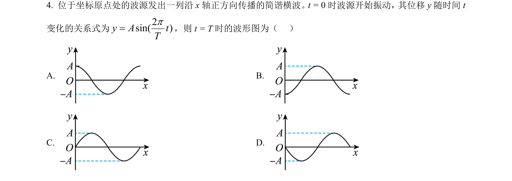
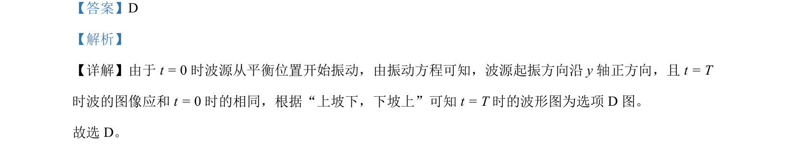

## 题面

## 摘要

根据波源振动方程判断起振方向，结合波的传播规律确定某时刻波形图。

## 关联考点

- [[362-机械波|机械波]]
- [[波的图像]]
- [[振动方向与传播方向关系]]

## 答案与解析

> 📄 原 PDF 第 2 页：`素材/真题/北京/2008-2024·（北京）物理高考真题/2023年高考物理试卷（北京）（解析卷）.pdf`

<!-- 题干文本-start -->
## 题干文本
4. 位于坐标原点处的波源发出一列沿 x轴正方向传播的简谐横波。t = 0时波源开始振动，其位移y随时间 t
变化的关系式为 2sin( )y A tTp=，则 t = T时的波形图为（   ）
A.   B.   
C.   D.
<!-- 题干文本-end -->

<!-- 解析文本-start -->
## 解析文本
【答案】D
【解析】
【详解】由于 t = 0时波源从平衡位置开始振动，由振动方程可知，波源起振方向沿 y轴正方向，且 t = T
时波的图像应和 t = 0时的相同，根据“上坡下，下坡上”可知 t = T时的波形图为选项 D 图。
故选 D。
<!-- 解析文本-end -->
