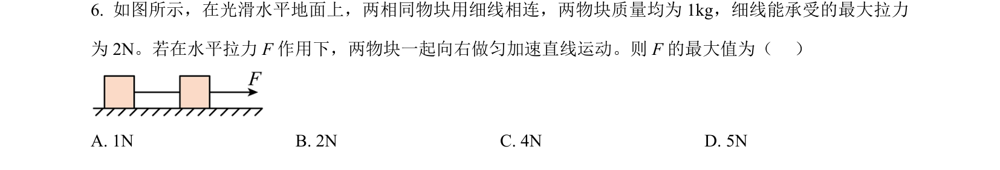
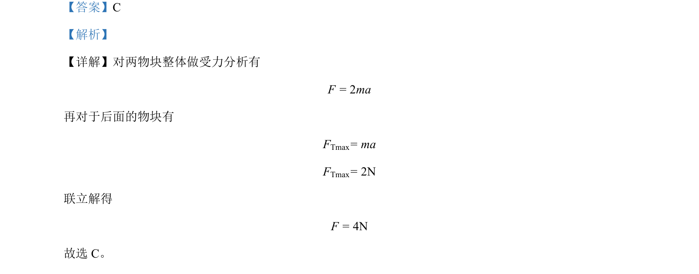

## 题面

## 摘要

通过整体法与隔离法分析连接体问题，求解使系统保持相对静止的最大外力。

## 关联考点

- [[847-整体法|整体法]]
- [[855-隔离法|隔离法]]
- [[229-牛顿第二定律|牛顿第二定律]]

## 答案与解析

> 📄 原 PDF 第 3 页：`素材/真题/北京/2008-2024·（北京）物理高考真题/2023年高考物理试卷（北京）（解析卷）.pdf`
