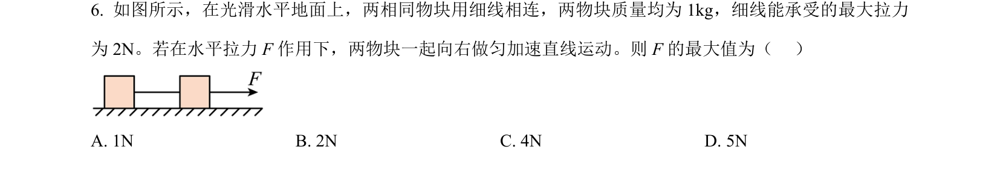
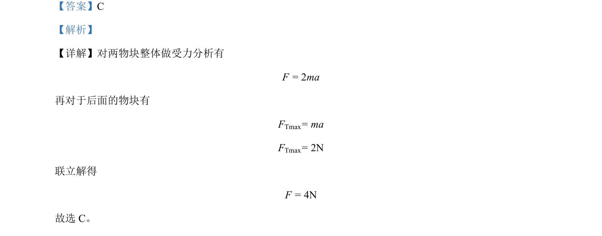

## 题面

## 摘要

通过整体法与隔离法分析连接体问题，求解使系统保持相对静止的最大外力。

## 关联考点

- [[847-整体法|整体法]]
- [[855-隔离法|隔离法]]
- [[229-牛顿第二定律|牛顿第二定律]]

## 答案与解析

> 📄 原 PDF 第 3 页：`素材/真题/北京/2008-2024·（北京）物理高考真题/2023年高考物理试卷（北京）（解析卷）.pdf`

<!-- 题干文本-start -->
## 题干文本
6. 如图所示，在光滑水平地面上，两相同物块用细线相连，两物块质量均为 1kg，细线能承受的最大拉力
为 2N。若在水平拉力 F作用下，两物块一起向右做匀加速直线运动。则 F的最大值为（   ）
  
A. 1N B. 2N C. 4N D. 5N
<!-- 题干文本-end -->

<!-- 解析文本-start -->
## 解析文本
【答案】C
【解析】
【详解】对两物块整体做受力分析有
F = 2ma
再对于后面的物块有
FTmax= ma
FTmax= 2N
联立解得
F = 4N
故选 C。
<!-- 解析文本-end -->
