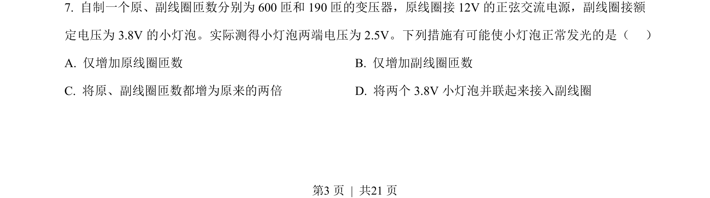
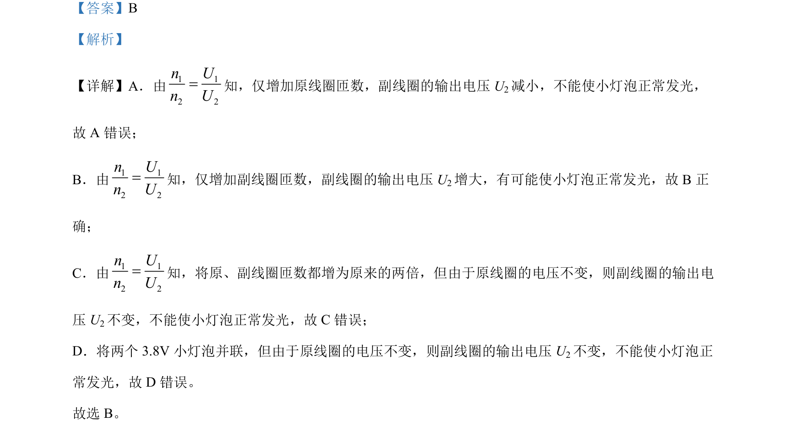

## 题面

## 摘要

本题通过改变变压器原副线圈匝数，分析副线圈输出电压变化对小灯泡正常发光的影响。

## 关联考点

- [[398-理想变压器|理想变压器]]
- [[电压比与匝数比关系]]
- [[副线圈输出电压]]

## 答案与解析

> 📄 原 PDF 第 3 页：`素材/真题/北京/2008-2024·（北京）物理高考真题/2023年高考物理试卷（北京）（解析卷）.pdf`
