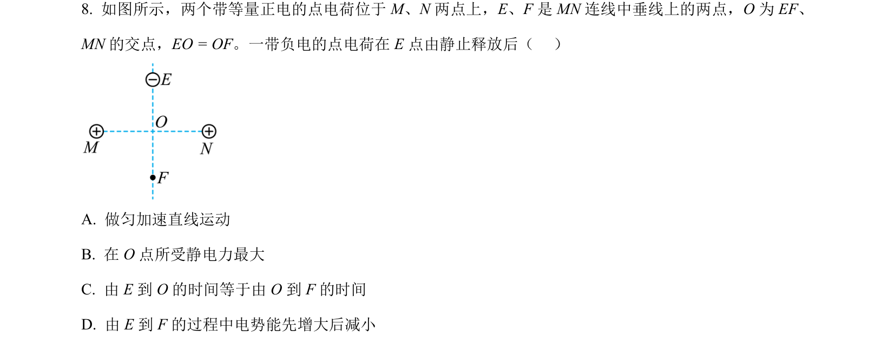
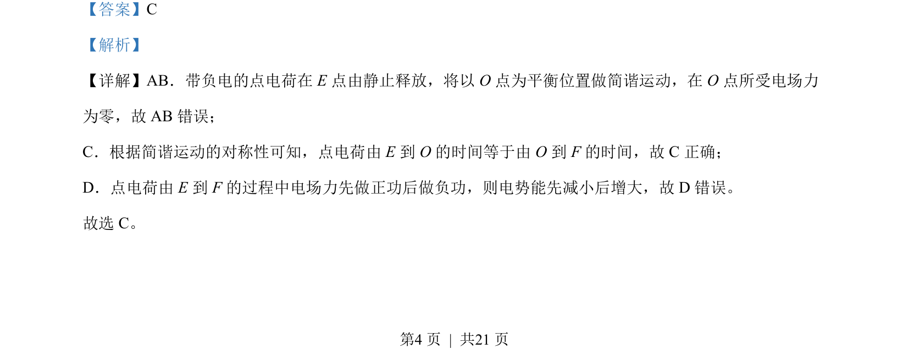

## 题面

## 摘要

点电荷在电场中做简谐运动，判断运动时间和电势能变化

## 关联考点

- [[373-简谐运动|简谐运动]]
- [[672-电场力|电场力]]
- [[276-电势能|电势能]]
- [[835-对称性|对称性]]

## 答案与解析

> 📄 原 PDF 第 4 页：`素材/真题/北京/2008-2024·（北京）物理高考真题/2023年高考物理试卷（北京）（解析卷）.pdf`
