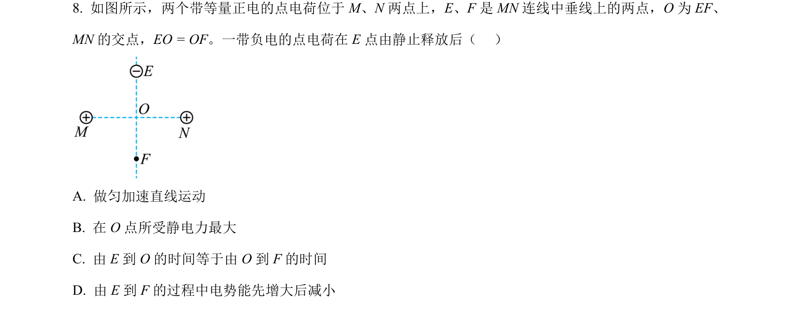
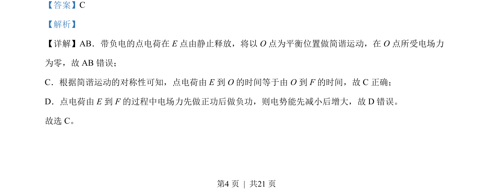

## 题面

## 摘要

点电荷在电场中做简谐运动，判断运动时间和电势能变化

## 关联考点

- [[373-简谐运动|简谐运动]]
- [[672-电场力|电场力]]
- [[276-电势能|电势能]]
- [[835-对称性|对称性]]

## 答案与解析

> 📄 原 PDF 第 4 页：`素材/真题/北京/2008-2024·（北京）物理高考真题/2023年高考物理试卷（北京）（解析卷）.pdf`

<!-- 题干文本-start -->
## 题干文本
8. 如图所示，两个带等量正电的点电荷位于 M、N 两点上，E、F 是 MN 连线中垂线上的两点，O 为 EF、
MN 的交点，EO = OF。一带负电的点电荷在 E点由静止释放后（   ）
  
A. 做匀加速直线运动
B. 在 O 点所受静电力最大
C. 由 E到 O 的时间等于由 O 到 F的时间
D. 由 E到 F的过程中电势能先增大后减小
<!-- 题干文本-end -->

<!-- 解析文本-start -->
## 解析文本
【答案】C
【解析】
【详解】AB．带负电的点电荷在 E点由静止释放，将以 O 点为平衡位置做简谐运动，在 O 点所受电场力
为零，故 AB 错误；
C．根据简谐运动的对称性可知，点电荷由 E到 O 的时间等于由 O 到 F的时间，故 C正确；
D．点电荷由 E到 F的过程中电场力先做正功后做负功，则电势能先减小后增大，故 D 错误。
故选 C。
<!-- 解析文本-end -->
