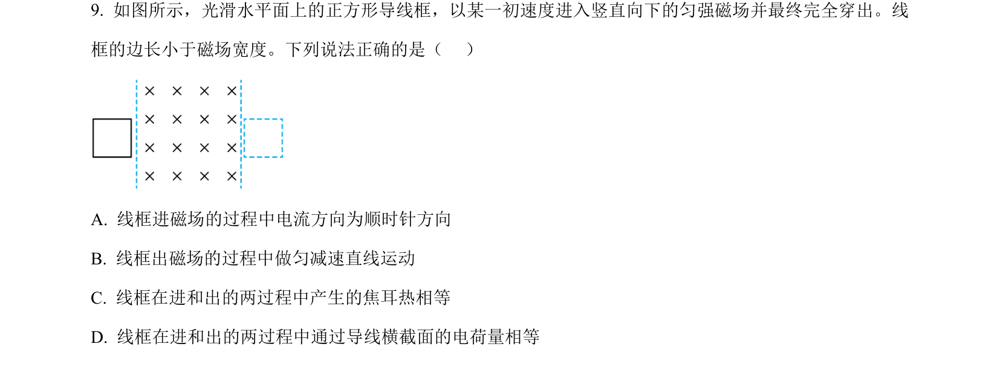
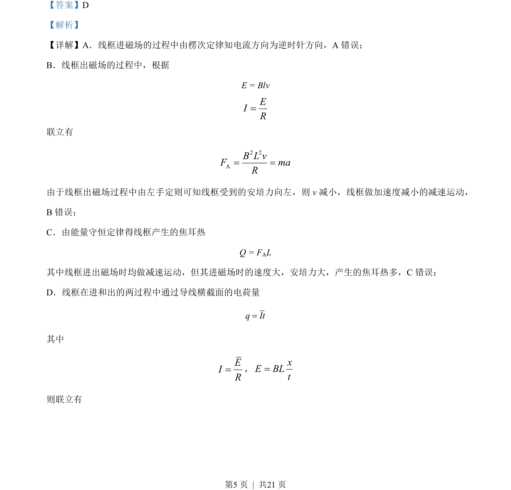
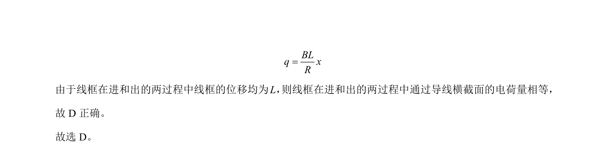

## 题面

## 摘要

线框进出磁场过程，考查楞次定律、安培力、能量守恒及电荷量计算，判断各选项正误。

## 关联考点

- [[393-楞次定律|楞次定律]]
- [[188-磁场对通电导体的作用|安培力]]
- [[173-电热|焦耳热]]
- [[180-电荷量|电荷量]]

## 答案与解析

> 📄 原 PDF 第 5 页：`素材/真题/北京/2008-2024·（北京）物理高考真题/2023年高考物理试卷（北京）（解析卷）.pdf`
