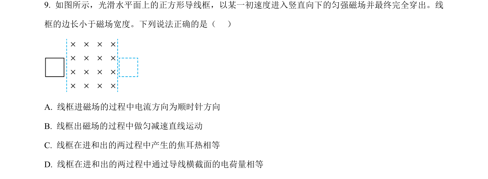
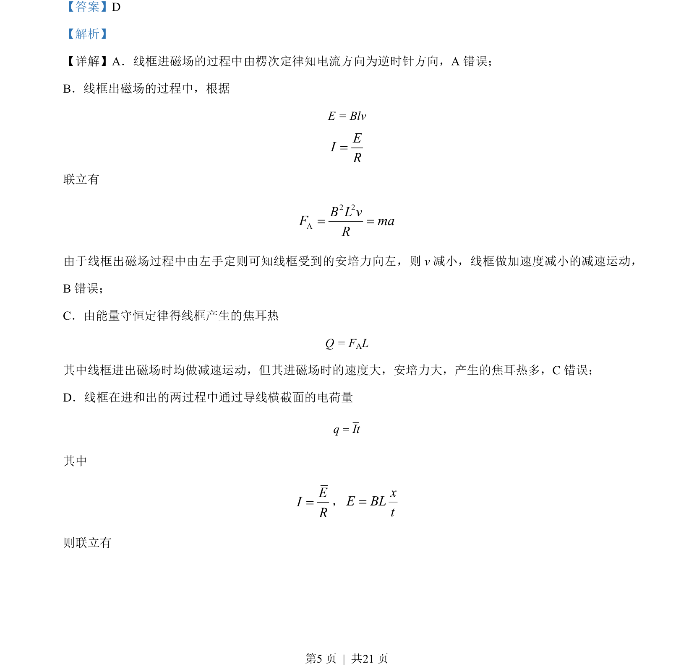
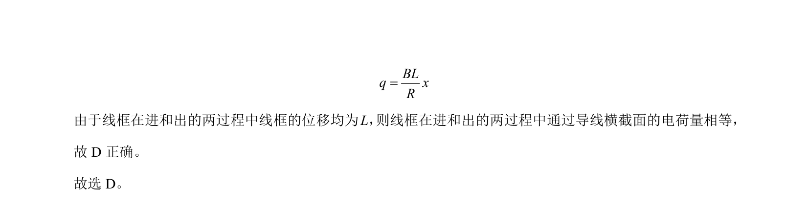

## 题面

## 摘要

线框进出磁场过程，考查楞次定律、安培力、能量守恒及电荷量计算，判断各选项正误。

## 关联考点

- [[393-楞次定律|楞次定律]]
- [[188-磁场对通电导体的作用|安培力]]
- [[173-电热|焦耳热]]
- [[180-电荷量|电荷量]]

## 答案与解析

> 📄 原 PDF 第 5 页：`素材/真题/北京/2008-2024·（北京）物理高考真题/2023年高考物理试卷（北京）（解析卷）.pdf`

<!-- 题干文本-start -->
## 题干文本
9. 如图所示，光滑水平面上的正方形导线框，以某一初速度进入竖直向下的匀强磁场并最终完全穿出。线
框的边长小于磁场宽度。下列说法正确的是（   ）
  
A. 线框进磁场的过程中电流方向为顺时针方向
B. 线框出磁场的过程中做匀减速直线运动
C. 线框在进和出的两过程中产生的焦耳热相等
D. 线框在进和出的两过程中通过导线横截面的电荷量相等
<!-- 题干文本-end -->

<!-- 解析文本-start -->
## 解析文本
【答案】D
【解析】
【详解】A．线框进磁场的过程中由楞次定律知电流方向为逆时针方向，A 错误；
B．线框出磁场的过程中，根据
E = Blv
EIR=
联立有
2 2AB L vF maR= =
由于线框出磁场过程中由左手定则可知线框受到的安培力向左，则 v 减小，线框做加速度减小的减速运动，
B错误；
C．由能量守恒定律得线框产生的焦耳热
Q = FAL
其中线框进出磁场时均做减速运动，但其进磁场时的速度大，安培力大，产生的焦耳热多，C错误；
D．线框在进和出的两过程中通过导线横截面的电荷量
q It=
其中
EIR=，xE BLt=
则联立有
<!-- 解析文本-end -->
