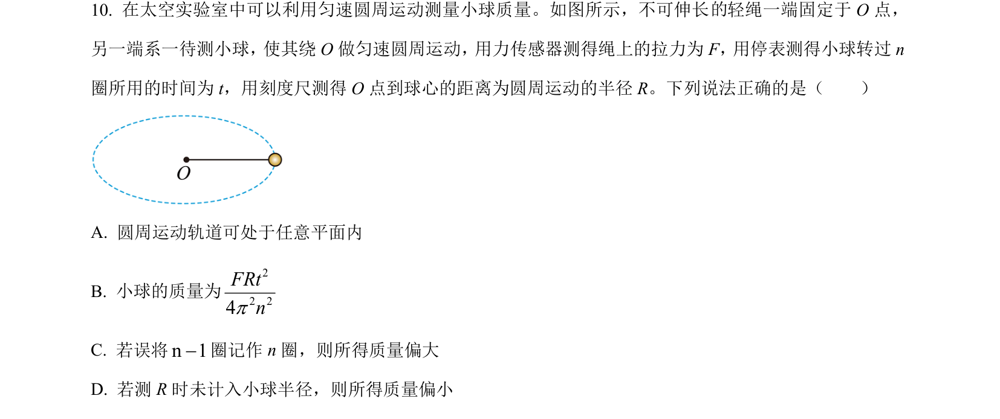
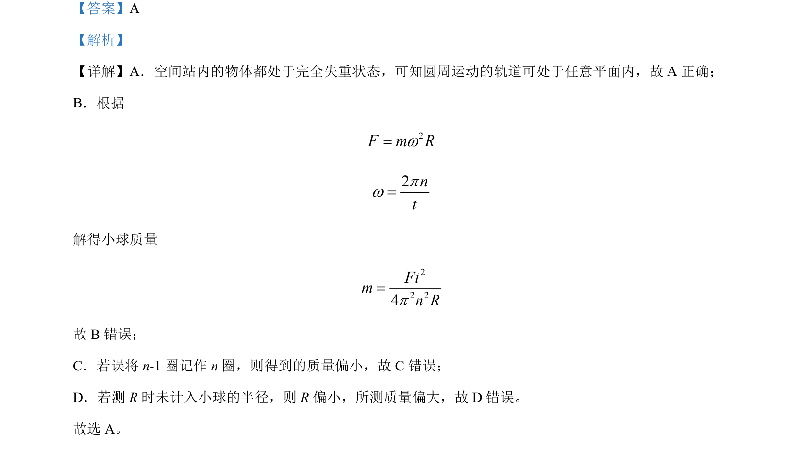

## 题面

## 摘要

空间站完全失重下圆周运动向心力测质量实验，分析各选项正误及误差影响。

## 关联考点

- [[831-完全失重|完全失重]]
- [[561-向心力公式|向心力公式]]
- [[842-实验误差分析|实验误差分析]]

## 答案与解析

> 📄 原 PDF 第 6 页：`素材/真题/北京/2008-2024·（北京）物理高考真题/2023年高考物理试卷（北京）（解析卷）.pdf`

<!-- 题干文本-start -->
## 题干文本
10. 在太空实验室中可以利用匀速圆周运动测量小球质量。如图所示，不可伸长 轻绳一端固定于 O 点，
另一端系一待测小球，使其绕O 做匀速圆周运动，用力传感器测得绳上的拉力为F，用停表测得小球转过n
圈所用的时间为 t，用刻度尺测得 O 点到球心的距离为圆周运动的半径 R。下列说法正确的是（　　）
  
A. 圆周运动轨道可处于任意平面内
B. 小球的质量为
22 24FRtnp
C. 若误将n 1-圈记作 n 圈，则所得质量偏大
D. 若测 R时未计入小球半径，则所得质量偏小
<!-- 题干文本-end -->

<!-- 解析文本-start -->
## 解析文本
【答案】A
【解析】
【详解】A．空间站内的物体都处于完全失重状态，可知圆周运动的轨道可处于任意平面内，故 A 正确；
B．根据
2F m Rw=2ntpw=
解得小球质量
22 24Ftmn Rp=
故 B错误；
C．若误将 n-1 圈记作 n 圈，则得到的质量偏小，故 C错误；
D．若测 R时未计入小球的半径，则 R偏小，所测质量偏大，故 D 错误。
故选 A。
<!-- 解析文本-end -->
