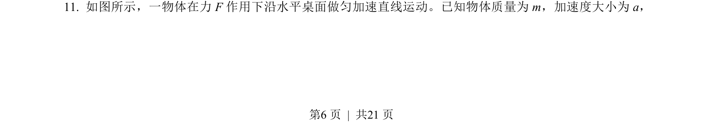
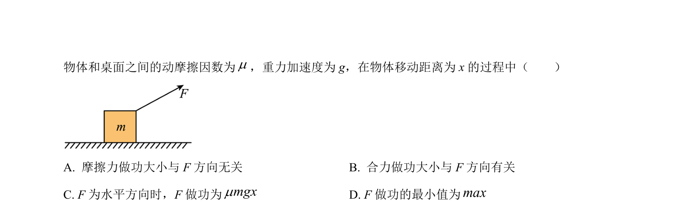
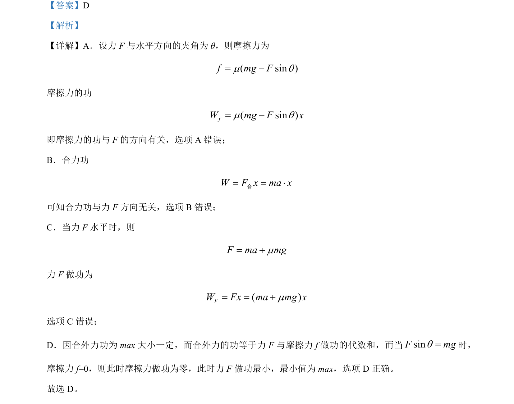

## 题面

## 摘要

考查力F方向对摩擦力做功和合力做功的影响，涉及功的计算及最小做功条件分析。

## 关联考点

- [[062-功-物理|功]]
- [[081-摩擦力|摩擦力]]
- [[合力]]
- [[力与运动]]

## 答案与解析

> 📄 原 PDF 第 6 页：`素材/真题/北京/2008-2024·（北京）物理高考真题/2023年高考物理试卷（北京）（解析卷）.pdf`
