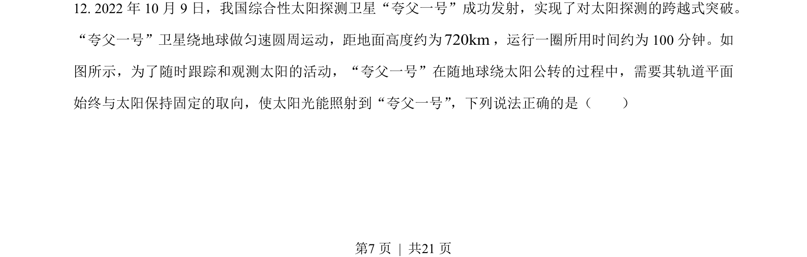
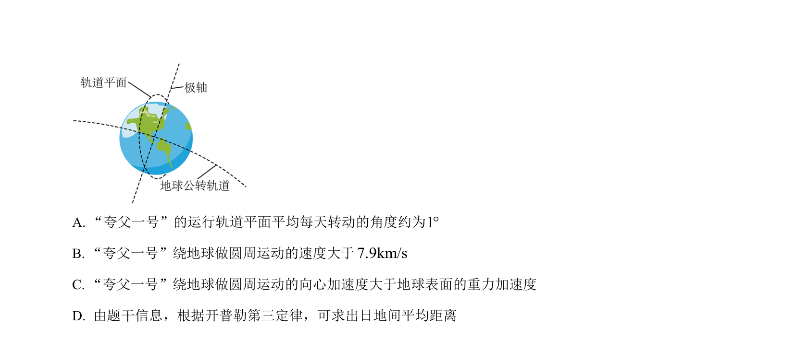
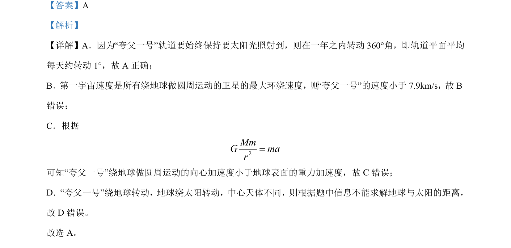

## 题面

## 摘要

夸父一号卫星轨道特点及万有引力定律应用，比较第一宇宙速度、向心加速度与重力加速度

## 关联考点

- [[246-万有引力定律|万有引力定律]]
- [[卫星轨道]]
- [[281-第一宇宙速度|第一宇宙速度]]
- [[257-向心加速度|向心加速度]]

## 答案与解析

> 📄 原 PDF 第 7 页：`素材/真题/北京/2008-2024·（北京）物理高考真题/2023年高考物理试卷（北京）（解析卷）.pdf`
