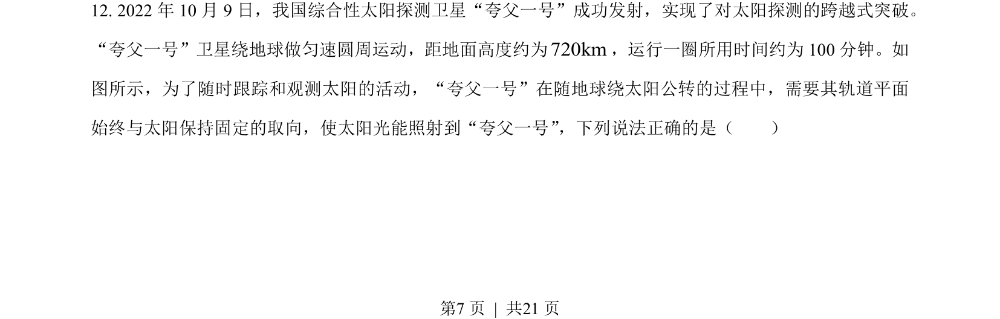
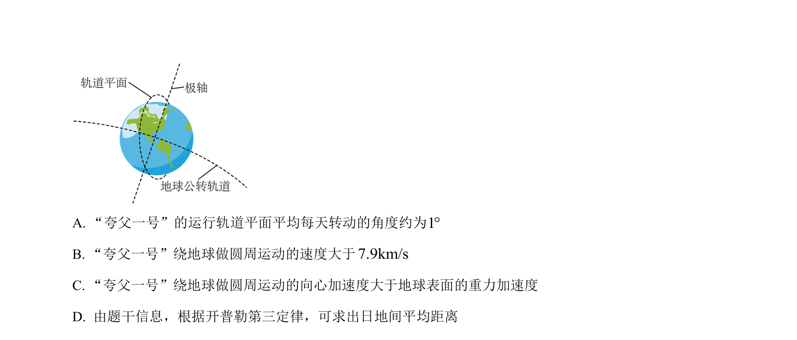
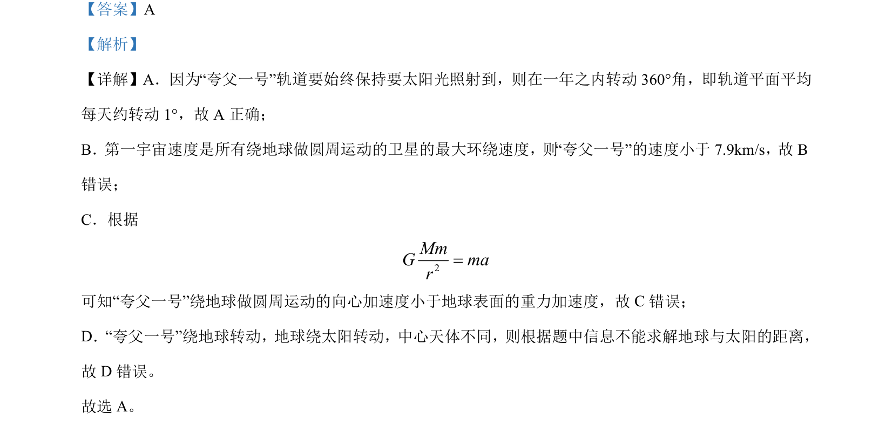

## 题面

## 摘要

夸父一号卫星轨道特点及万有引力定律应用，比较第一宇宙速度、向心加速度与重力加速度

## 关联考点

- [[246-万有引力定律|万有引力定律]]
- [[卫星轨道]]
- [[281-第一宇宙速度|第一宇宙速度]]
- [[257-向心加速度|向心加速度]]

## 答案与解析

> 📄 原 PDF 第 7 页：`素材/真题/北京/2008-2024·（北京）物理高考真题/2023年高考物理试卷（北京）（解析卷）.pdf`

<!-- 题干文本-start -->
## 题干文本
12. 2022 年 10 月 9 日，我国综合性太阳探测卫星“夸父一号”成功发射，实现了对太阳探测的跨越式突破。
“夸父一号”卫星绕地球做匀速圆周运动，距地面高度约为720km，运行一圈所用时间约为 100 分钟。如
图所示，为了随时跟踪和观测太阳的活动，“夸父一号”在随地球绕太阳公转的过程中，需要其轨道平面
始终与太阳保持固定的取向，使太阳光能照射到“夸父一号”，下列说法正确的是（　　）
<!-- 题干文本-end -->

<!-- 解析文本-start -->
## 解析文本

<!-- 解析文本-end -->
