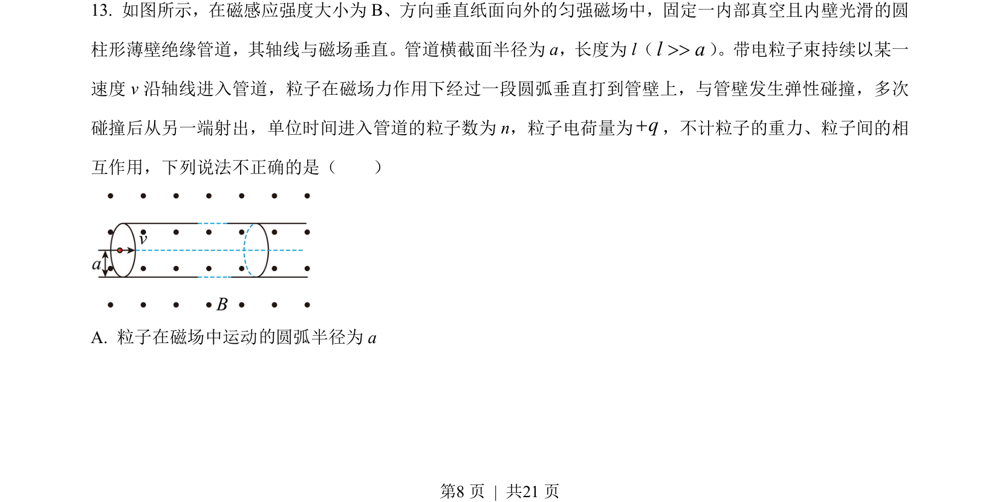
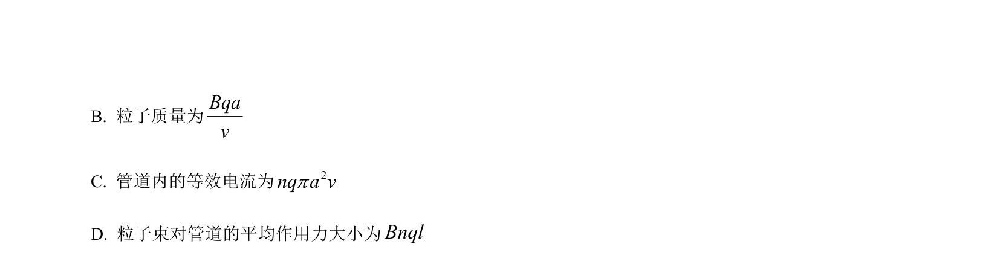
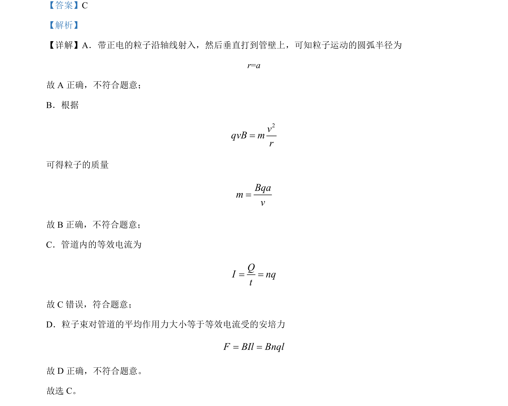

## 题面

## 摘要

带正电粒子在磁场中做圆周运动，结合等效电流和安培力计算粒子束对管道作用力。

## 关联考点

- [[843-带电粒子在匀强磁场中的圆周运动|带电粒子在匀强磁场中的圆周运动]]
- [[188-磁场对通电导体的作用|安培力]]
- [[电流定义]]

## 答案与解析

> 📄 原 PDF 第 8 页：`素材/真题/北京/2008-2024·（北京）物理高考真题/2023年高考物理试卷（北京）（解析卷）.pdf`
