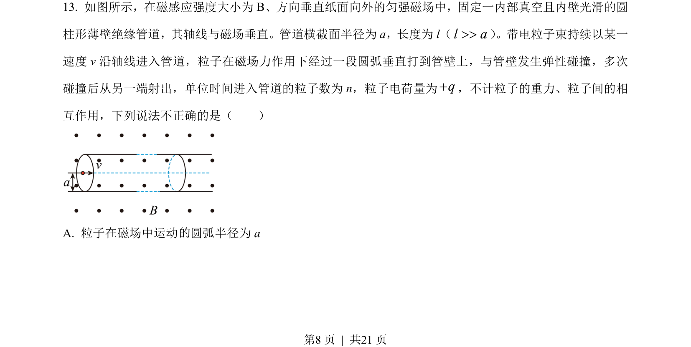
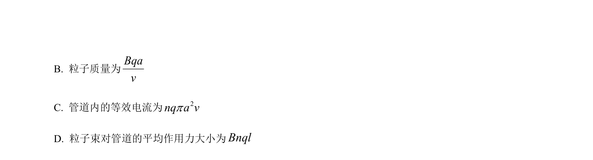
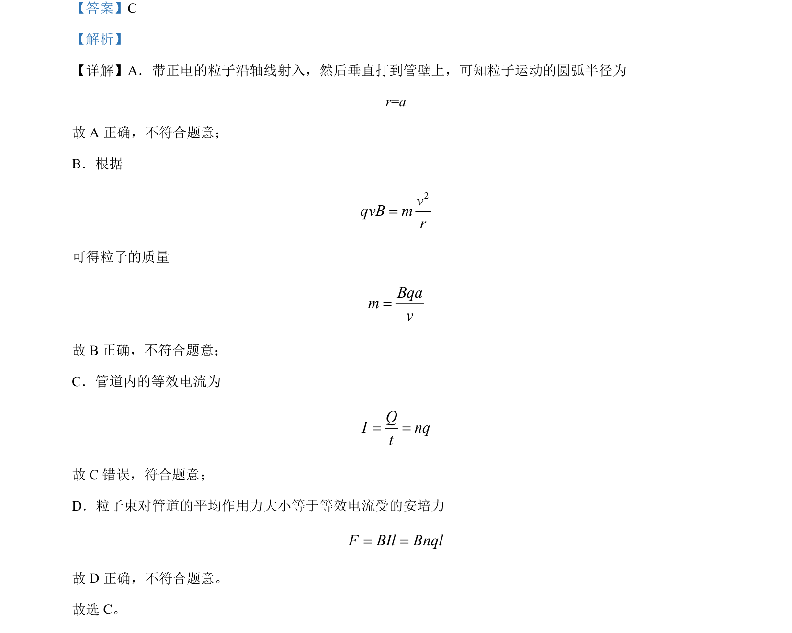

## 题面

## 摘要

带正电粒子在磁场中做圆周运动，结合等效电流和安培力计算粒子束对管道作用力。

## 关联考点

- [[843-带电粒子在匀强磁场中的圆周运动|带电粒子在匀强磁场中的圆周运动]]
- [[188-磁场对通电导体的作用|安培力]]
- [[电流定义]]

## 答案与解析

> 📄 原 PDF 第 8 页：`素材/真题/北京/2008-2024·（北京）物理高考真题/2023年高考物理试卷（北京）（解析卷）.pdf`

<!-- 题干文本-start -->
## 题干文本
13. 如图所示，在磁感应强度大小为 B、方向垂直纸面向外的匀强磁场中，固定一内部真空且内壁光滑的圆
柱形薄壁绝缘管道，其轴线与磁场垂直。管道横截面半径为a，长度为 l（l a>>） 。带电粒子束持续以某一
速度 v 沿轴线进入管道，粒子在磁场力作用下经过一段圆弧垂直打到管壁上，与管壁发生弹性碰撞，多次
碰撞后从另一端射出，单位时间进入管道的粒子数为 n，粒子电荷量为q+，不计粒子的重力、粒子间的相
互作用，下列说法不正确的是（　　）
  
A. 粒子在磁场中运动 圆弧半径为 a
的
<!-- 题干文本-end -->

<!-- 解析文本-start -->
## 解析文本

<!-- 解析文本-end -->
