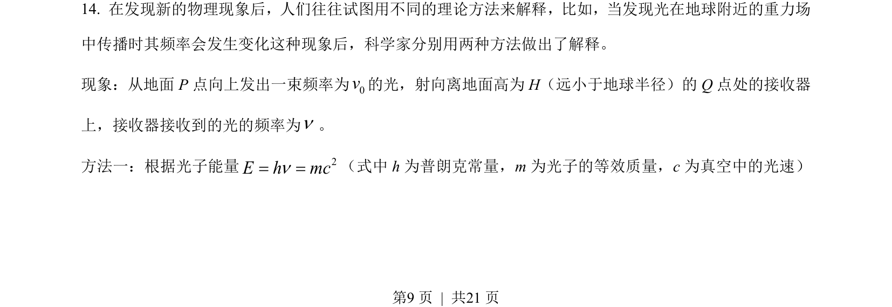
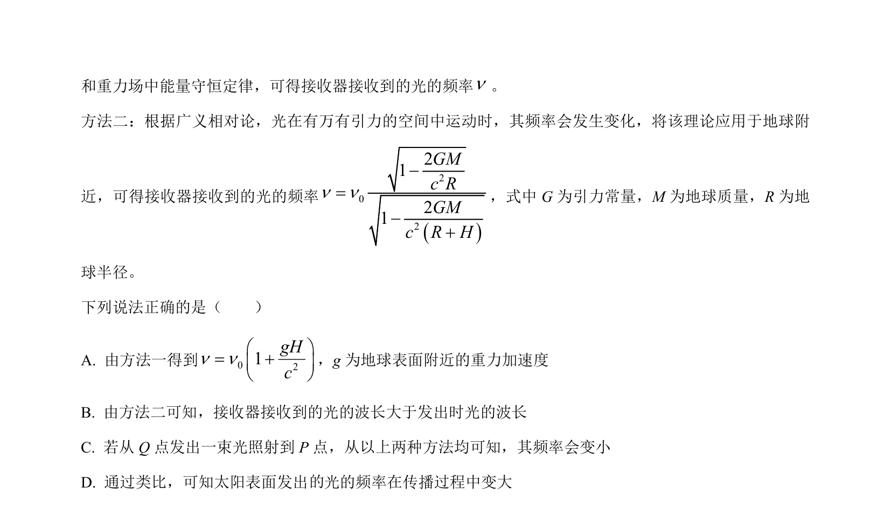
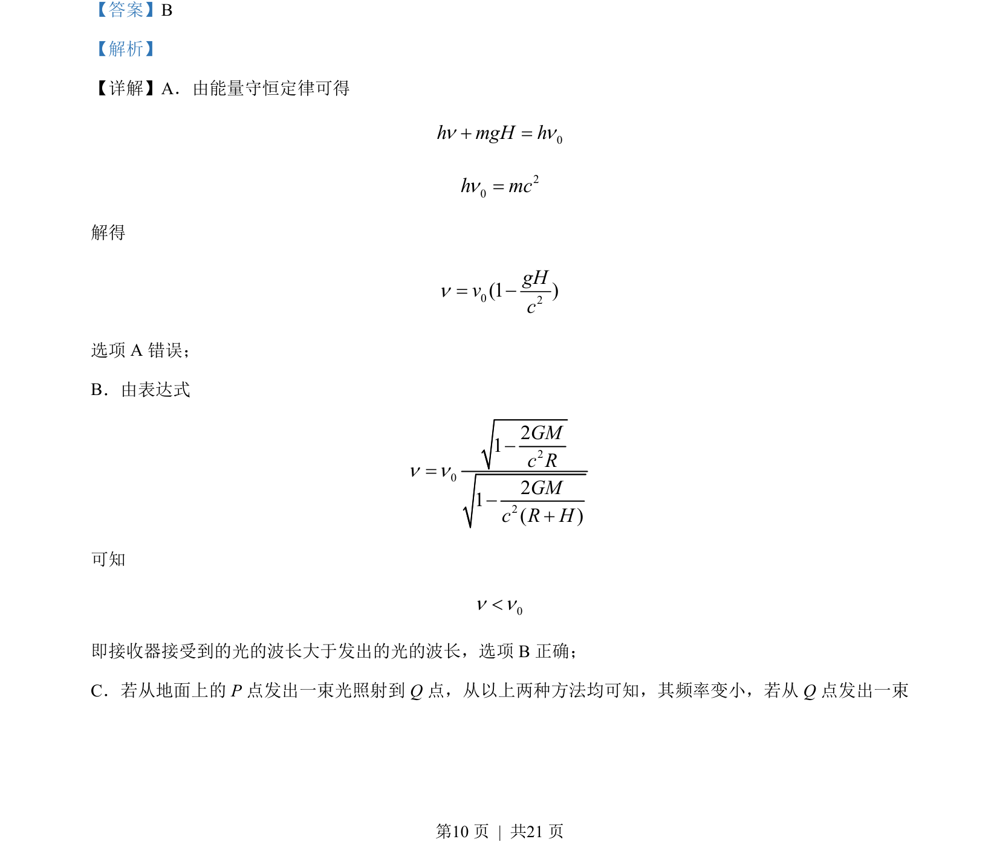
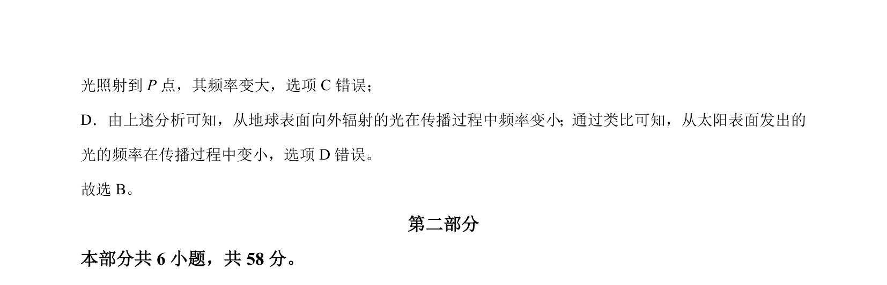

## 题面

## 摘要

引力红移现象及光子能量变化与频率波长关系的判断

## 关联考点

- [[197-能量守恒定律|能量守恒定律]]
- [[引力红移]]
- [[479-波长与频率关系|波长频率关系]]

## 答案与解析

> 📄 原 PDF 第 9 页：`素材/真题/北京/2008-2024·（北京）物理高考真题/2023年高考物理试卷（北京）（解析卷）.pdf`

<!-- 题干文本-start -->
## 题干文本
14. 在发现新的物理现象后，人们往往试图用不同的理论方法来解释，比如，当发现光在地球附近的重力场
中传播时其频率会发生变化这种现象后，科学家分别用两种方法做出了解释。
现象：从地面 P点向上发出一束频率为0v的光，射向离地面高为 H（远小于地球半径）的 Q 点处的接收器
上，接收器接收到的光的频率为n。
方法一：根据光子能量 2E h mcn= =（式中 h 为普朗克常量，m 为光子的等效质量，c 为真空中的光速）
<!-- 题干文本-end -->

<!-- 解析文本-start -->
## 解析文本

<!-- 解析文本-end -->
