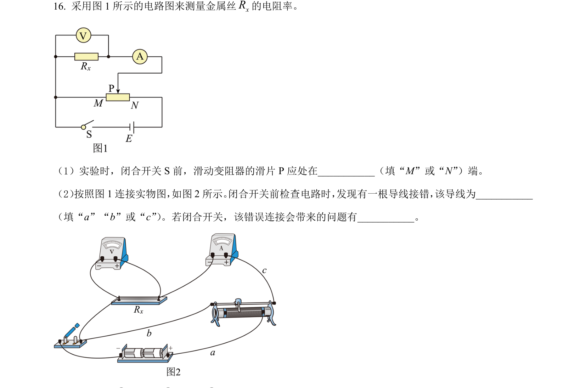
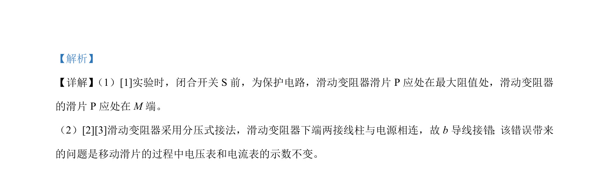

## 题面

## 摘要

考查滑动变阻器分压接法中的电路保护及连接错误分析

## 关联考点

- [[滑动变阻器的分压接法]]
- [[电路保护]]
- [[183-电路故障分析|电路故障分析]]

## 答案与解析

> 📄 原 PDF 第 11 页：`素材/真题/北京/2008-2024·（北京）物理高考真题/2023年高考物理试卷（北京）（解析卷）.pdf`

<!-- 题干文本-start -->
## 题干文本
16. 采用图 1 所示的电路图来测量金属丝xR的电阻率。
  
（1）实验时，闭合开关 S 前，滑动变阻器的滑片 P 应处在___________（填“M”或“N”）端。
（2） 按照图1连接实物图， 如图2所示。 闭合开关前检查电路时， 发现有一根导线接错， 该导线为___________
（填“a”“b”或“c”） 。若闭合开关，该错误连接会带来的问题有___________。
<!-- 题干文本-end -->

<!-- 解析文本-start -->
## 解析文本
【答案】    ①. M    ②. b    ③. 移动滑片时，电压表和电流表的示数不变
<!-- 解析文本-end -->
