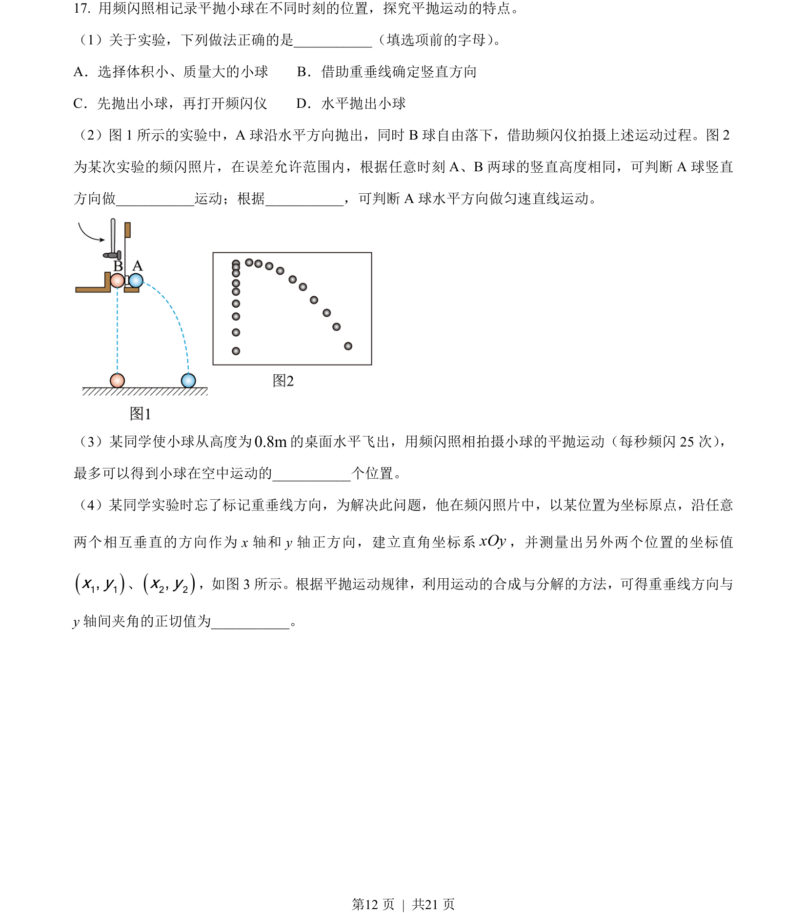
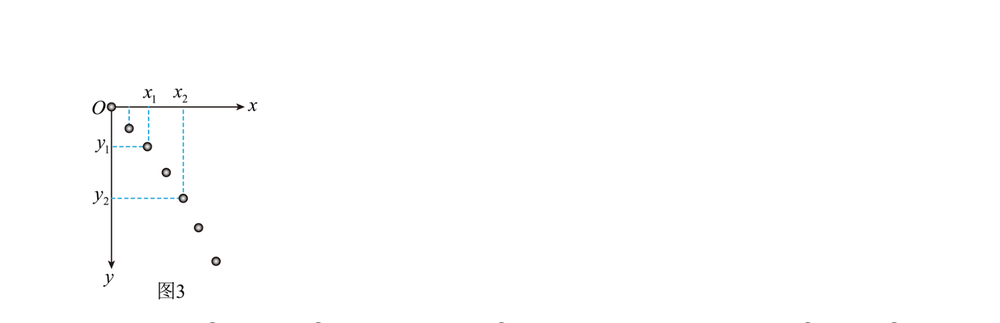
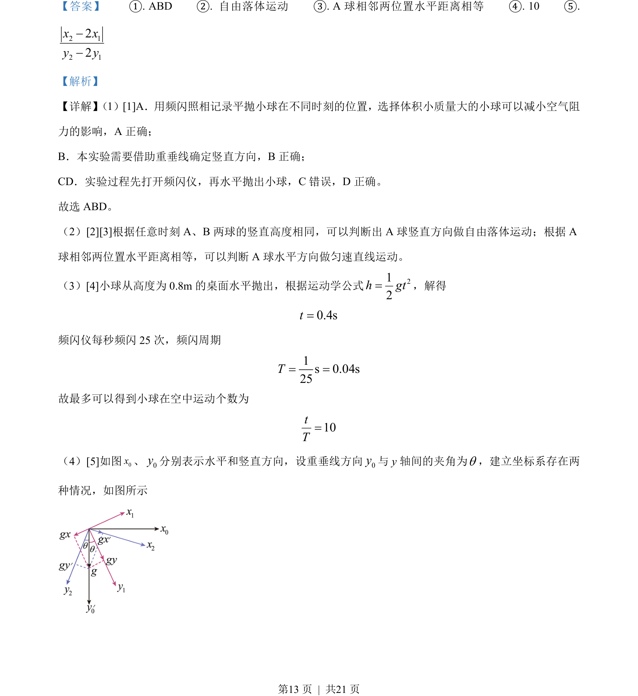
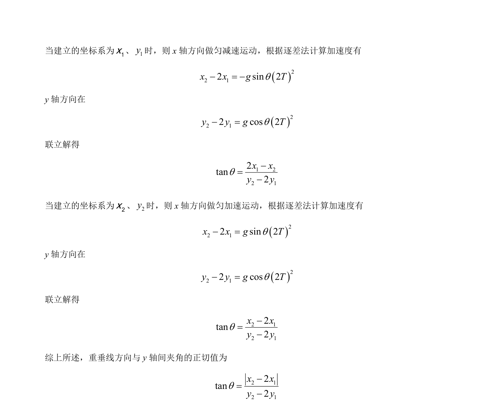

## 题面

## 摘要

利用频闪照相研究平抛运动的分运动特性，并通过坐标变换分析加速度分量。

## 关联考点

- [[261-平抛运动|平抛运动]]
- [[288-运动的合成与分解|运动的合成与分解]]
- [[741-逐差法|逐差法]]
- [[582-实验数据处理|实验数据处理]]

## 答案与解析

> 📄 原 PDF 第 12 页：`素材/真题/北京/2008-2024·（北京）物理高考真题/2023年高考物理试卷（北京）（解析卷）.pdf`
