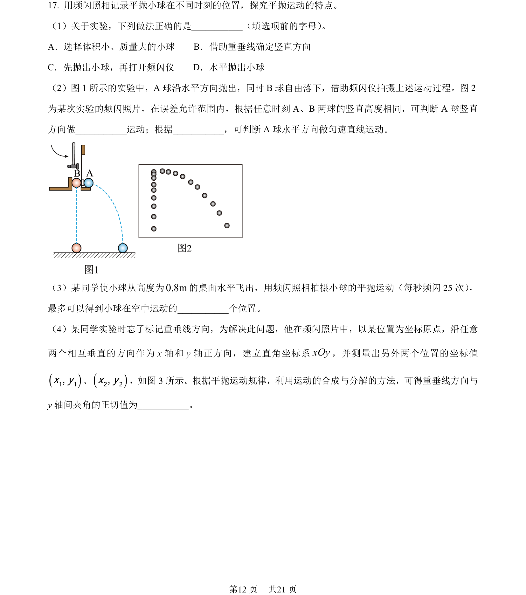
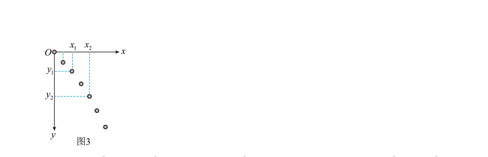
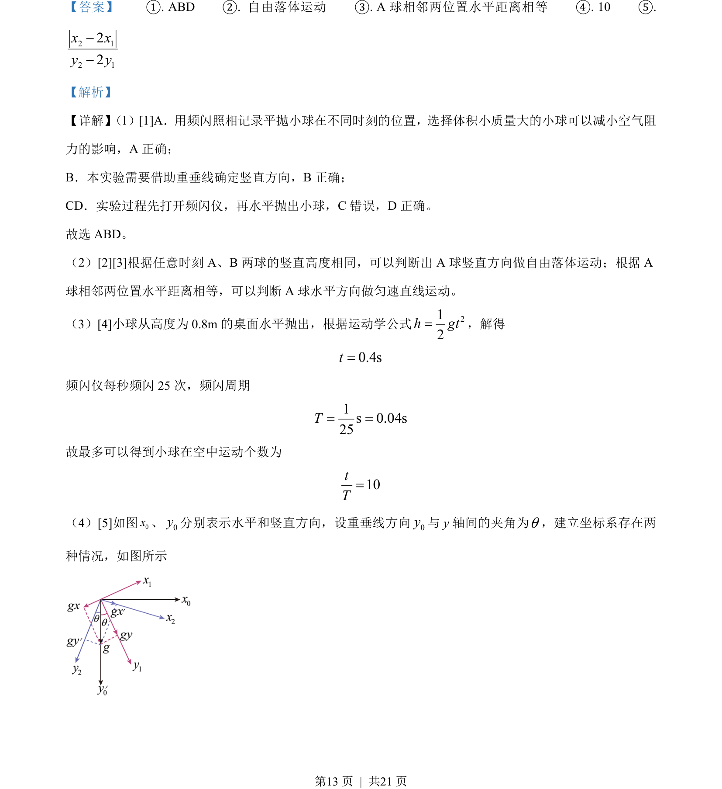
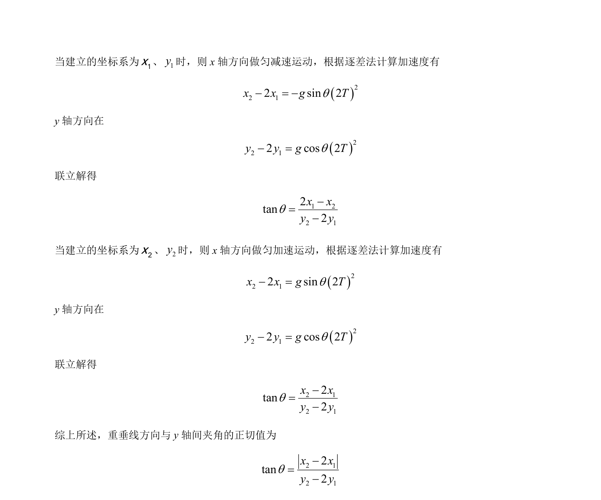

## 题面

## 摘要

利用频闪照相研究平抛运动的分运动特性，并通过坐标变换分析加速度分量。

## 关联考点

- [[261-平抛运动|平抛运动]]
- [[288-运动的合成与分解|运动的合成与分解]]
- [[740-逐差法|逐差法]]
- [[582-实验数据处理|实验数据处理]]

## 答案与解析

> 📄 原 PDF 第 12 页：`素材/真题/北京/2008-2024·（北京）物理高考真题/2023年高考物理试卷（北京）（解析卷）.pdf`

<!-- 题干文本-start -->
## 题干文本
17. 用频闪照相记录平抛小球在不同时刻的位置，探究平抛运动的特点。
（1）关于实验，下列做法正确的是___________（填选项前的字母） 。
A．选择体积小、质量大的小球     B ．借助重垂线确定竖直方向
C．先抛出小球，再打开频闪仪     D ．水平抛出小球
（2）图 1 所示的实验中，A 球沿水平方向抛出，同时 B球自由落下，借助频闪仪拍摄上述运动过程。图 2
为某次实验的频闪照片，在误差允许范围内，根据任意时刻 A、B 两球的竖直高度相同，可判断 A 球竖直
方向做___________运动；根据___________，可判断 A 球水平方向做匀速直线运动。
    
（3）某同学使小球从高度为0.8m的桌面水平飞出，用频闪照相拍摄小球的平抛运动（每秒频闪 25 次） ，
最多可以得到小球在空中运动的___________个位置。
（4）某同学实验时忘了标记重垂线方向，为解决此问题，他在频闪照片中，以某位置为坐标原点，沿任意
两个相互垂直的方向作为 x 轴和 y 轴正方向，建立直角坐标系xOy，并测量出另外两个位置的坐标值
1 1,x y、2 2,x y，如图 3 所示。根据平抛运动规律，利用运动的合成与分解的方法，可得重垂线方向与
y轴间夹角的正切值为___________。
<!-- 题干文本-end -->

<!-- 解析文本-start -->
## 解析文本

<!-- 解析文本-end -->
