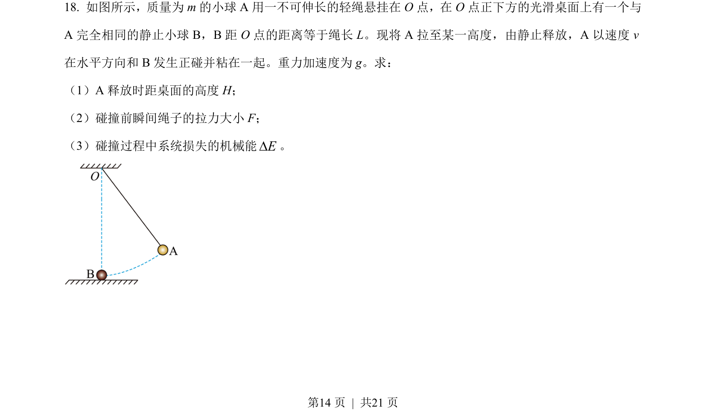
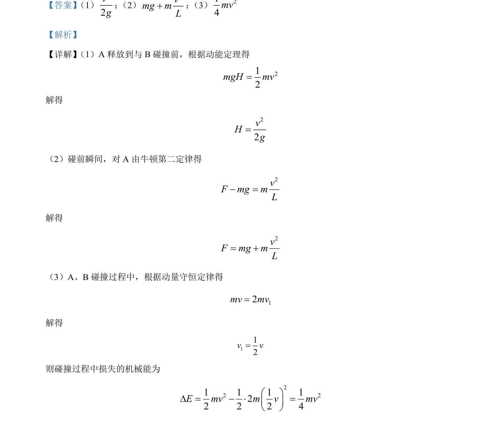

## 题面

## 摘要

A先加速后与B碰撞，综合考查动能定理、圆周运动向心力及动量守恒中的能量损失计算。

## 关联考点

- [[251-动能定理|动能定理]]
- [[229-牛顿第二定律|牛顿第二定律]]
- [[347-动量守恒定律|动量守恒定律]]
- [[机械能损失]]

## 答案与解析

> 📄 原 PDF 第 14 页：`素材/真题/北京/2008-2024·（北京）物理高考真题/2023年高考物理试卷（北京）（解析卷）.pdf`
