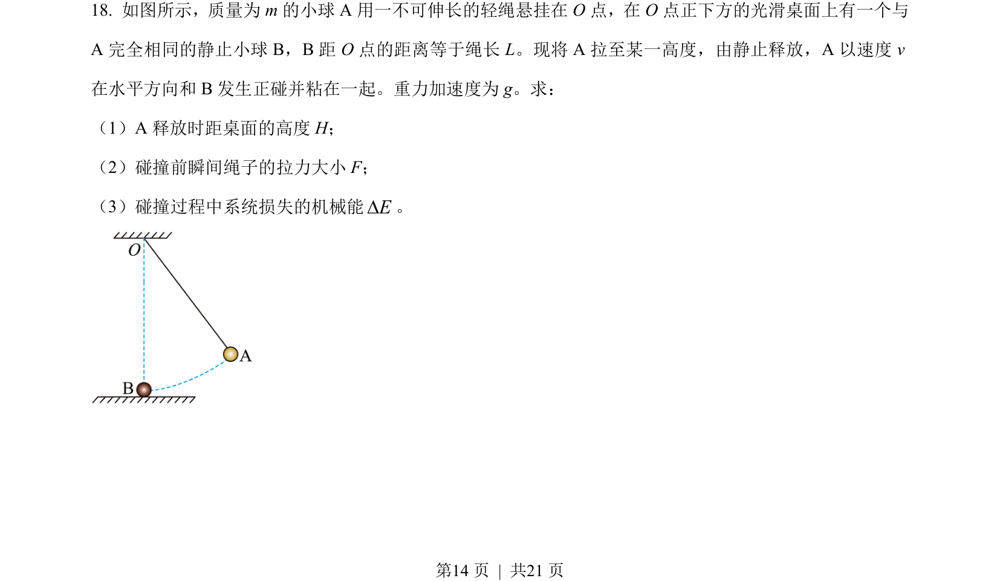
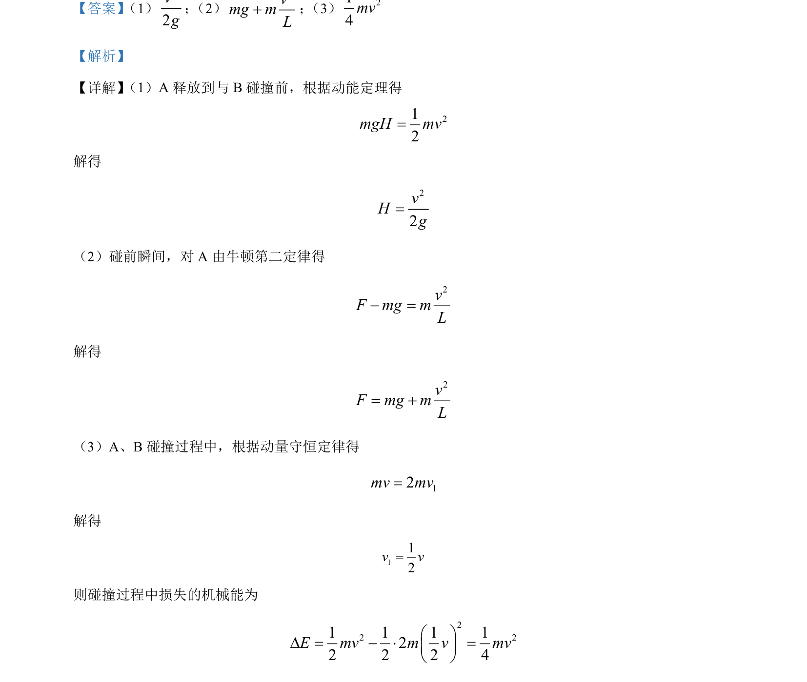

## 题面

## 摘要

A先加速后与B碰撞，综合考查动能定理、圆周运动向心力及动量守恒中的能量损失计算。

## 关联考点

- [[251-动能定理|动能定理]]
- [[229-牛顿第二定律|牛顿第二定律]]
- [[347-动量守恒定律|动量守恒定律]]
- [[机械能损失]]

## 答案与解析

> 📄 原 PDF 第 14 页：`素材/真题/北京/2008-2024·（北京）物理高考真题/2023年高考物理试卷（北京）（解析卷）.pdf`

<!-- 题干文本-start -->
## 题干文本
18. 如图所示，质量为 m 的小球 A 用一不可伸长的轻绳悬挂在 O 点，在 O 点正下方的光滑桌面上有一个与
A 完全相同的静止小球 B，B 距 O 点的距离等于绳长 L。现将 A 拉至某一高度，由静止释放， A 以速度 v
在水平方向和 B发生正碰并粘在一起。重力加速度为 g。求：
（1）A 释放时距桌面的高度 H；
（2）碰撞前瞬间绳子的拉力大小 F；
（3）碰撞过程中系统损失的机械能ED。
<!-- 题干文本-end -->

<!-- 解析文本-start -->
## 解析文本

<!-- 解析文本-end -->
