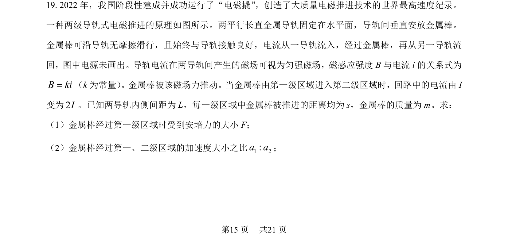
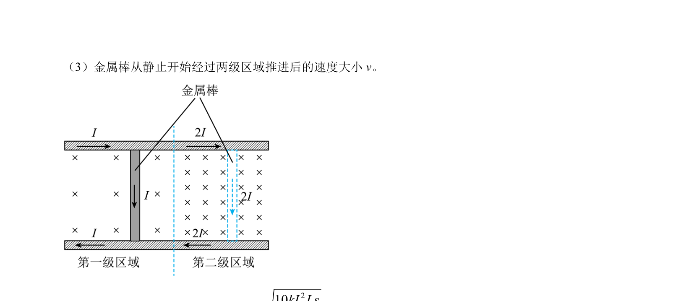
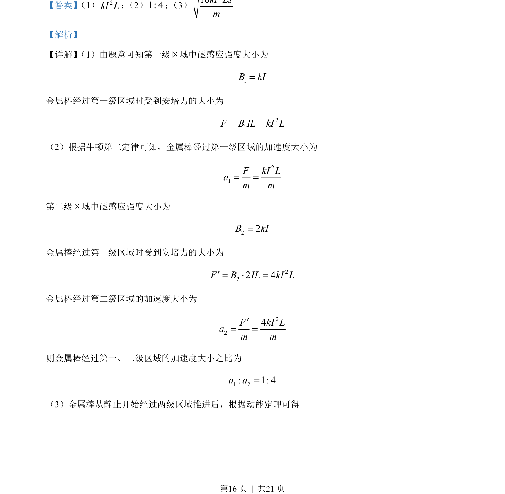

## 题面

## 摘要

金属棒在分级电磁推进装置中受安培力加速，涉及安培力计算与动能定理应用。

## 关联考点

- [[188-磁场对通电导体的作用|安培力]]
- [[229-牛顿第二定律|牛顿第二定律]]
- [[251-动能定理|动能定理]]

## 答案与解析

> 📄 原 PDF 第 15 页：`素材/真题/北京/2008-2024·（北京）物理高考真题/2023年高考物理试卷（北京）（解析卷）.pdf`
