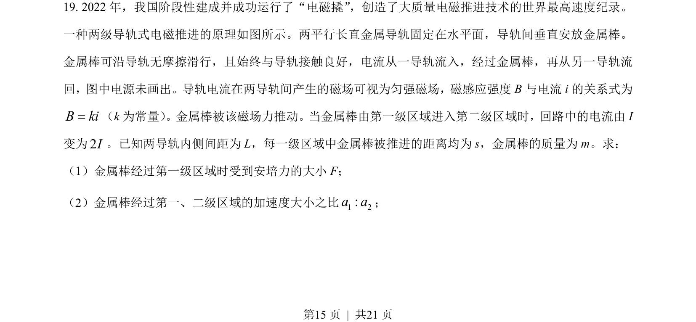
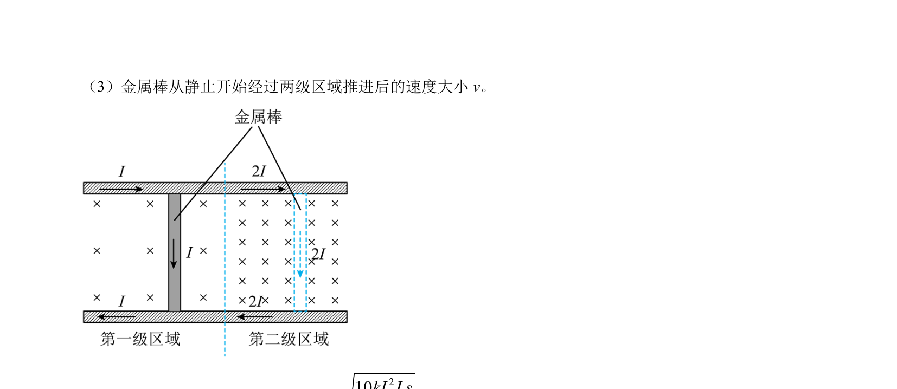
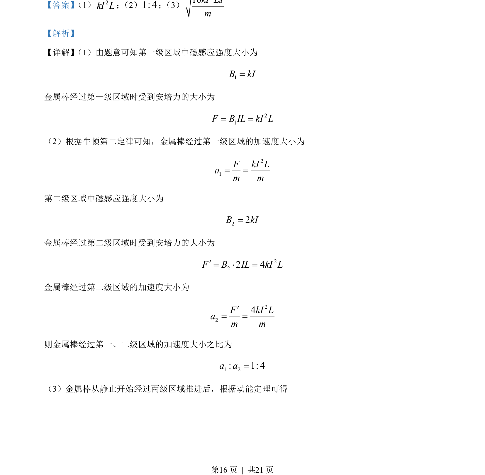

## 题面

## 摘要

金属棒在分级电磁推进装置中受安培力加速，涉及安培力计算与动能定理应用。

## 关联考点

- [[188-磁场对通电导体的作用|安培力]]
- [[229-牛顿第二定律|牛顿第二定律]]
- [[251-动能定理|动能定理]]

## 答案与解析

> 📄 原 PDF 第 15 页：`素材/真题/北京/2008-2024·（北京）物理高考真题/2023年高考物理试卷（北京）（解析卷）.pdf`

<!-- 题干文本-start -->
## 题干文本
19. 2022 年，我国阶段性建成并成功运行了“电磁撬”，创造了大质量电磁推进技术的世界最高速度纪录。
一种两级导轨式电磁推进的原理如图所示。两平行长直金属导轨固定在水平面，导轨间垂直安放金属棒。
金属棒可沿导轨无摩擦滑行，且始终与导轨接触良好，电流从一导轨流入，经过金属棒，再从另一导轨流
回，图中电源未画出。导轨电流在两导轨间产生的磁场可视为匀强磁场，磁感应强度B与电流 i的关系式为
B ki=（k为常量） 。金属棒被该磁场力推动。当金属棒由第一级区域进入第二级区域时，回路中的电流由I
变为2I。已知两导轨内侧间距为 L，每一级区域中金属棒被推进的距离均为 s，金属棒的质量为 m。求：
（1）金属棒经过第一级区域时受到安培力的大小 F；
（2）金属棒经过第一、二级区域的加速度大小之比1 2:a a；
<!-- 题干文本-end -->

<!-- 解析文本-start -->
## 解析文本

<!-- 解析文本-end -->
