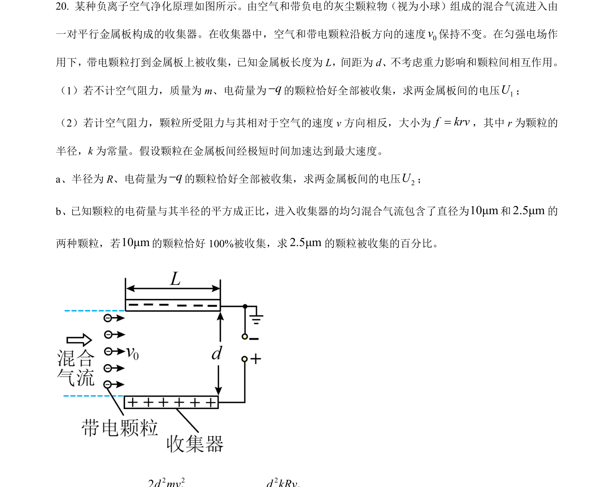
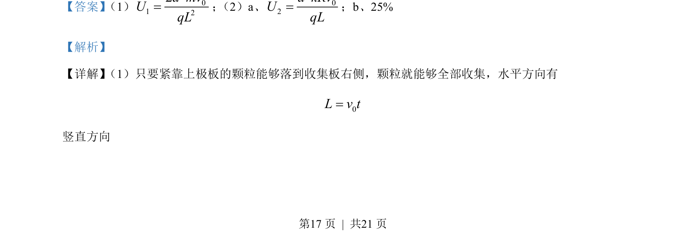
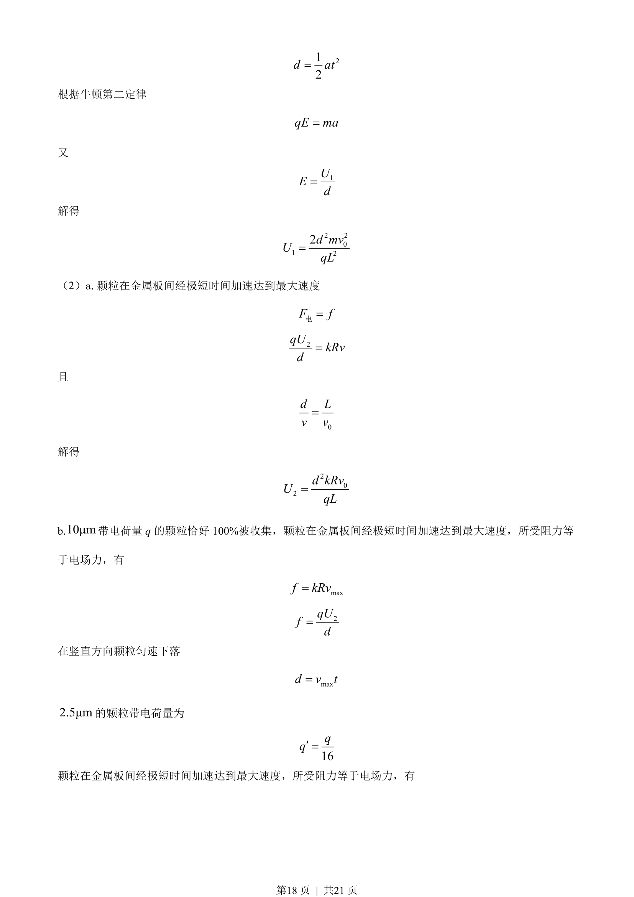
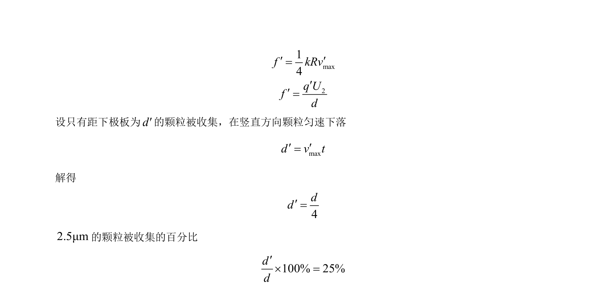

## 题面

## 摘要

本题考查带电颗粒在电场中的偏转与收集，涉及临界条件、电场力与阻力平衡及收集百分比计算。

## 关联考点

- [[597-带电粒子在电场中的偏转|带电粒子在电场中的偏转]]
- [[229-牛顿第二定律|牛顿第二定律]]
- [[672-电场力|电场力]]
- [[阻力平衡]]
- [[收集效率]]

## 答案与解析

> 📄 原 PDF 第 17 页：`素材/真题/北京/2008-2024·（北京）物理高考真题/2023年高考物理试卷（北京）（解析卷）.pdf`
