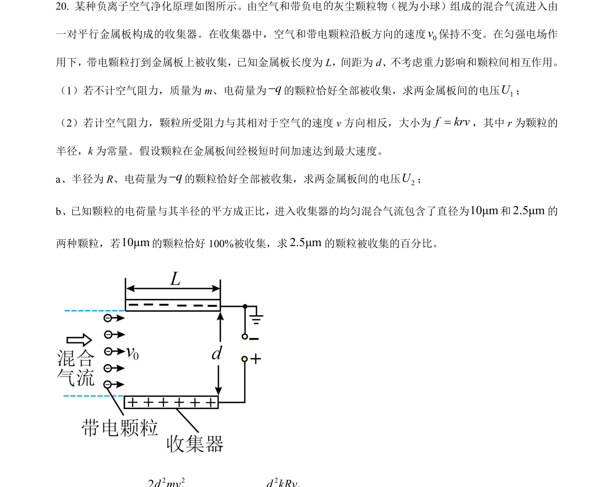
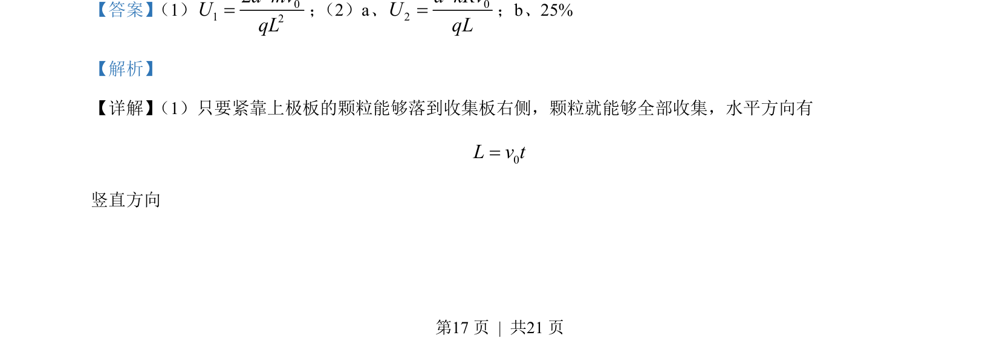
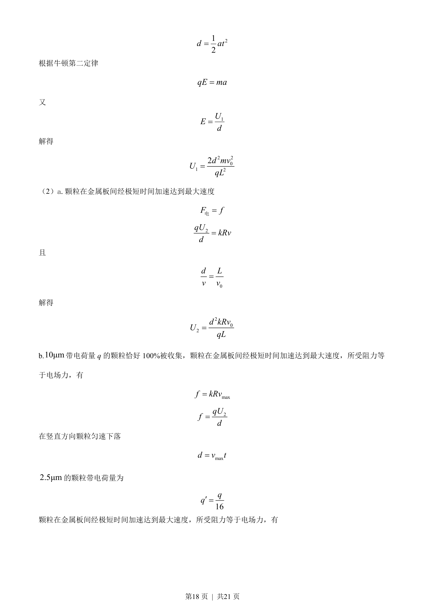
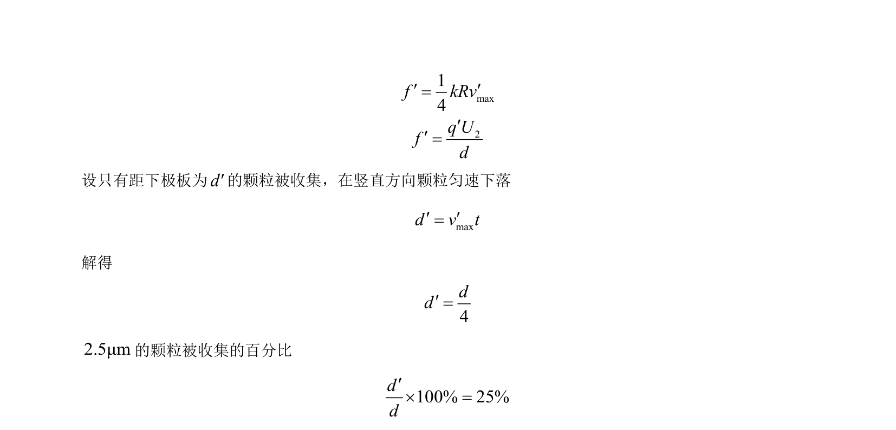

## 题面

## 摘要

本题考查带电颗粒在电场中的偏转与收集，涉及临界条件、电场力与阻力平衡及收集百分比计算。

## 关联考点

- [[298-带电粒子在电场中偏转|带电粒子在电场中的偏转]]
- [[229-牛顿第二定律|牛顿第二定律]]
- [[672-电场力|电场力]]
- [[阻力平衡]]
- [[收集效率]]

## 答案与解析

> 📄 原 PDF 第 17 页：`素材/真题/北京/2008-2024·（北京）物理高考真题/2023年高考物理试卷（北京）（解析卷）.pdf`

<!-- 题干文本-start -->
## 题干文本
20. 某种负离子空气净化原理如图所示。由空气和带负电 灰尘颗粒物（视为小球）组成的混合气流进入由
一对平行金属板构成的收集器。在收集器中，空气和带电颗粒沿板方向的速度0v保持不变。在匀强电场作
用下， 带电颗粒打到金属板上被收集， 已知金属板长度为L，间距为d、不考虑重力影响和颗粒间相互作用。
（1）若不计空气阻力，质量为 m、电荷量为q-的颗粒恰好全部被收集，求两金属板间的电压1U；
（2）若计空气阻力，颗粒所受阻力与其相对于空气的速度 v 方向相反，大小为f krv=，其中 r 为颗粒的
半径，k为常量。假设颗粒在金属板间经极短时间加速达到最大速度。
a、半径为 R、电荷量为q-的颗粒恰好全部被收集，求两金属板间的电压2U；
b、已知颗粒的电荷量与其半径的平方成正比，进入收集器的均匀混合气流包含了直径为10μm和2.5μm的
两种颗粒，若10μm的颗粒恰好 100%被收集，求2.5μm的颗粒被收集的百分比。
<!-- 题干文本-end -->

<!-- 解析文本-start -->
## 解析文本
【答案】 （1）
2 20122d mvUqL=； （2）a、
202d kRvUqL=；b、25%
【解析】
【详解】 （1）只要紧靠上极板的颗粒能够落到收集板右侧，颗粒就能够全部收集，水平方向有
0L v t=
竖直方向
的
<!-- 解析文本-end -->
