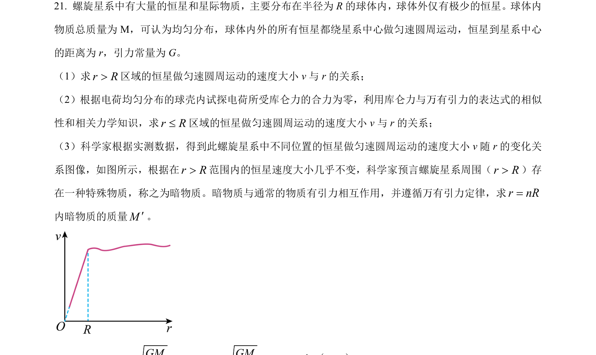
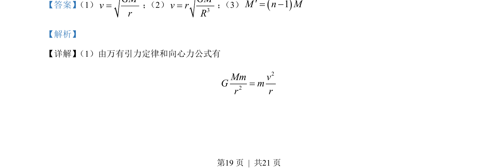
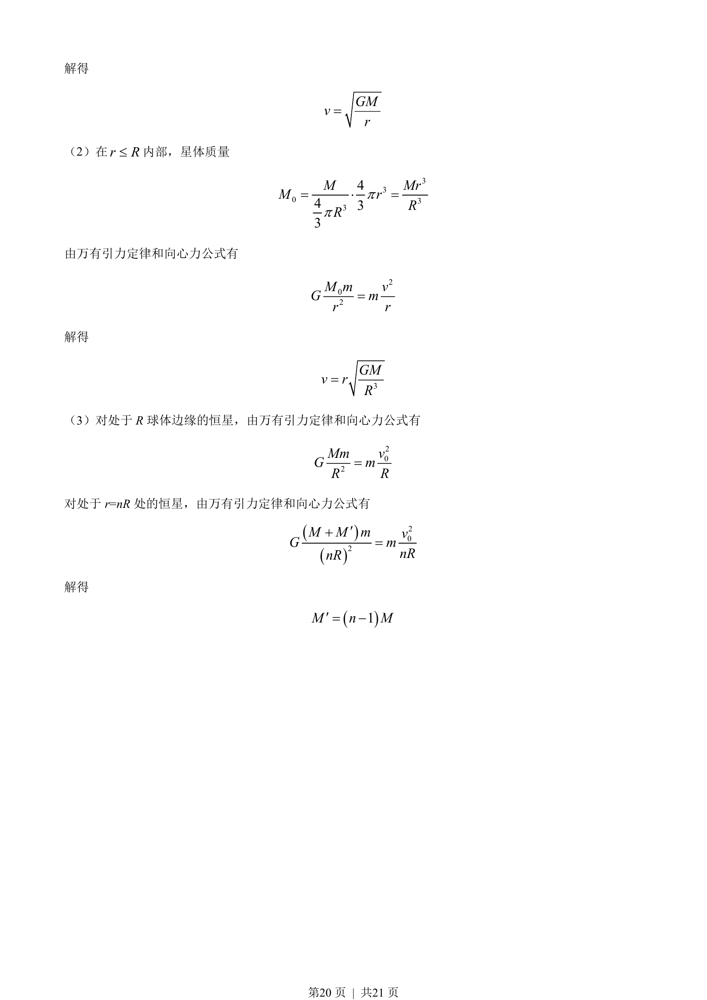

## 题面

## 摘要

该题考查应用万有引力定律和向心力公式分析均匀球体内外引力及质量分布问题。

## 关联考点

- [[246-万有引力定律|万有引力定律]]
- [[561-向心力公式|向心力公式]]
- [[质量分布]]
- [[253-匀速圆周运动|匀速圆周运动]]

## 答案与解析

> 📄 原 PDF 第 19 页：`素材/真题/北京/2008-2024·（北京）物理高考真题/2023年高考物理试卷（北京）（解析卷）.pdf`
