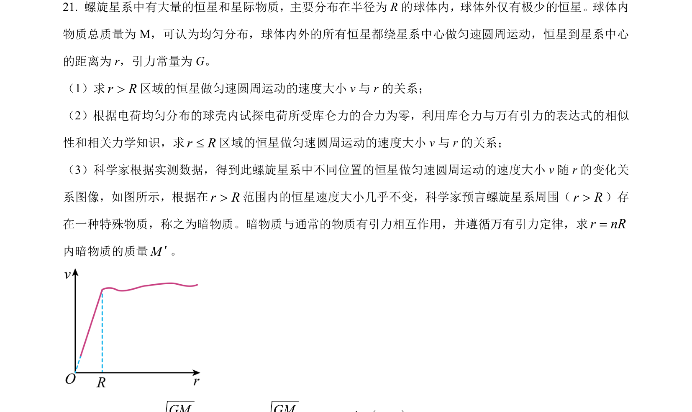
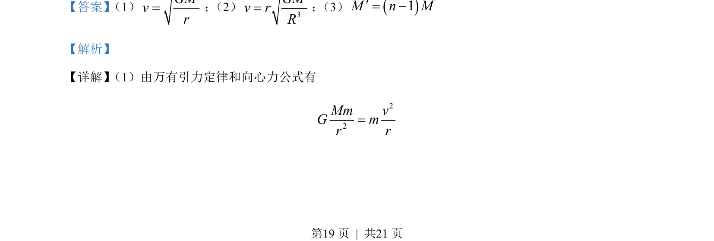
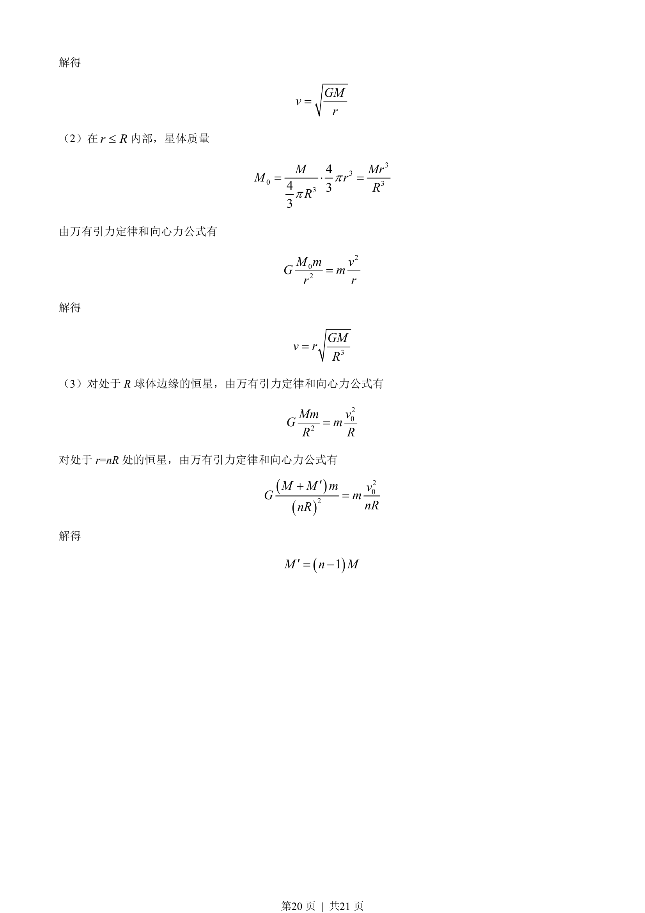

## 题面

## 摘要

该题考查应用万有引力定律和向心力公式分析均匀球体内外引力及质量分布问题。

## 关联考点

- [[246-万有引力定律|万有引力定律]]
- [[561-向心力公式|向心力公式]]
- [[质量分布]]
- [[253-匀速圆周运动|匀速圆周运动]]

## 答案与解析

> 📄 原 PDF 第 19 页：`素材/真题/北京/2008-2024·（北京）物理高考真题/2023年高考物理试卷（北京）（解析卷）.pdf`

<!-- 题干文本-start -->
## 题干文本
21. 螺旋星系中有大量的恒星和星际物质，主要分布在半径为R的球体内，球体外仅有极少的恒星。球体内
物质总质量为 M，可认为均匀分布，球体内外的所有恒星都绕星系中心做匀速圆周运动，恒星到星系中心
的距离为 r，引力常量为 G。
（1）求r R>区域的恒星做匀速圆周运动的速度大小 v与 r 的关系；
（2）根据电荷均匀分布的球壳内试探电荷所受库仑力的合力为零，利用库仑力与万有引力的表达式的相似
性和相关力学知识，求r R£区域的恒星做匀速圆周运动的速度大小 v与 r 的关系；
（3）科学家根据实测数据，得到此螺旋星系中不同位置的恒星做匀速圆周运动的速度大小 v 随 r 的变化关
系图像，如图所示，根据在r R>范围内的恒星速度大小几乎不变，科学家预言螺旋星系周围（r R>）存
在一种特殊物质，称之为暗物质。暗物质与通常的物质有引力相互作用，并遵循万有引力定律，求r nR=
内暗物质的质量M¢。
<!-- 题干文本-end -->

<!-- 解析文本-start -->
## 解析文本
【答案】 （1）GMvr=； （2） 3GMv rR=； （3）()1M n M¢= -
【解析】
【详解】 （1）由万有引力定律和向心力公式有
22Mm vG mr r=
<!-- 解析文本-end -->
