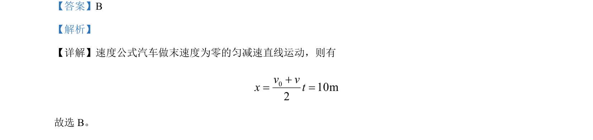

## 题面

## 摘要

汽车做匀减速直线运动至停止，利用平均速度公式计算位移。

## 关联考点

- [[215-匀变速直线运动|匀变速直线运动]]
- [[平均速度公式]]
- [[位移计算]]

## 答案与解析

> 📄 原 PDF 第 1 页：`素材/真题/北京/2008-2024·（北京）物理高考真题/2024年高考物理试卷（北京）（解析卷）.pdf`

<!-- 题干文本-start -->
## 题干文本
2. 一辆汽车以 10m/s 速度匀速行驶，制动后做匀减速直线运动，经 2s 停止，汽车的制动距离为（   ）
A. 5m B. 10m C. 20m D. 30m
<!-- 题干文本-end -->

<!-- 解析文本-start -->
## 解析文本
【答案】B
【解析】
【详解】速度公式汽车做末速度为零的匀减速直线运动，则有
010m2v vx t+= =
故选 B。
<!-- 解析文本-end -->
