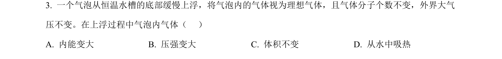
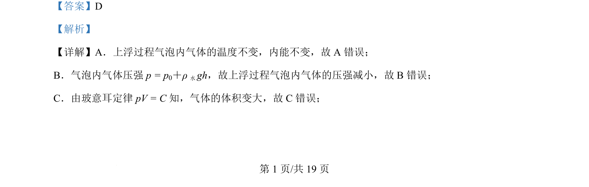
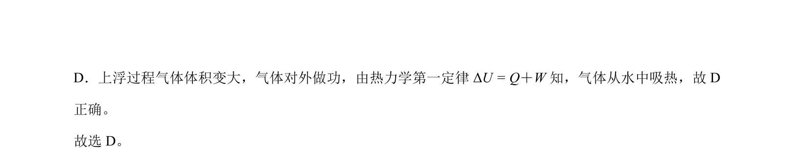

## 题面

## 摘要

气泡上浮过程温度不变，综合考查内能、压强变化、玻意耳定律及热力学第一定律的应用。

## 关联考点

- [[440-热力学第一定律|热力学第一定律]]
- [[444-玻意耳定律|玻意耳定律]]
- [[127-内能|内能]]
- [[096-液体压强|液体压强]]

## 答案与解析

> 📄 原 PDF 第 1 页：`素材/真题/北京/2008-2024·（北京）物理高考真题/2024年高考物理试卷（北京）（解析卷）.pdf`
